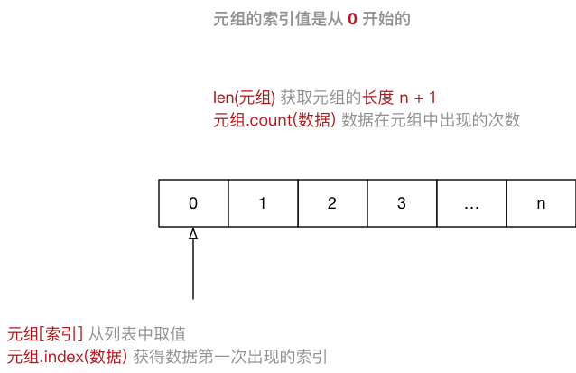

# python语法规则

python的格式十分严格，每行代码前面不要增加空格（代码有循环等逻辑的除外），否则会出现缩进错误。  
`python 2.x`默认不支持中文，它的解释器名称是`python`。  
`python 3.x`的解释器支持中文，它的解释器名称是`python3`。  
在终端中直接运行python解释器，退出时用`exit()`或者`ctrl + d`。

## 算术运算符   

### 基本运算符

| 运算符| 描述 | 实例 |
| :---: | :---: | --- |
| // | 取整除 | 返回除法的整数部分（商） 9 // 2 输出结果 4 |
| % | 取余数 | 返回除法的余数 9 % 2 = 1 |
| ** | 幂 | 又称次方、乘方，2 ** 3 = 8 |

在 Python 中 `*` 运算符还可以用于字符串，计算结果就是字符串重复指定次数的结果

```python
In [1]: "-" * 10
Out[1]: '----------' 
```

## 赋值运算符

| 运算符 | 描述 | 实例 |
| --- | --- | --- |
| = | 简单的赋值运算符 | c = a + b 将 a + b 的运算结果赋值为 c |
| += | 加法赋值运算符 | c += a 等效于 c = c + a |
| -= | 减法赋值运算符 | c -= a 等效于 c = c - a |
| *= | 乘法赋值运算符	 | c *= a 等效于 c = c * a |
| /= | 除法赋值运算符 | c /= a 等效于 c = c / a |
| //= | 取整除赋值运算符 | c //= a 等效于 c = c // a |
| %= | 取 **模** (余数)赋值运算符 | c %= a 等效于 c = c % a |
| **= | 幂赋值运算符 | c **= a 等效于 c = c ** a |

## 运算符的优先级

* 同级运算符是 **从左至右** 计算
* 可以使用 `()` 调整计算的优先级
* 以下表格的运算符优先级由高到最低顺序排列

| 运算符 | 描述 |
| --- | --- |
| ** | 幂 (最高优先级) |
| * / % // | 乘、除、取余数、取整除 |
| + - | 加法、减法 |
| <= < > >= | 比较运算符 |
| == != | 等于运算符 |
| = %= /= //= -= += *= **= | 赋值运算符 |
| not or and | 逻辑运算符 |

## 变量的基本使用

在python中，定义变量时是不需要指定变量的类型，在运行时，python解释器会根据赋值语句等号右侧的的数据自动推导出变量中保存数据的准确类型。  
### 不同类型变量之间的计算

 1) **数字型变量** 之间可以直接计算
* 在 Python 中，两个数字型变量是可以直接进行算数运算的
* 如果变量是 `bool` 型，在计算时
    * `True` 对应的数字是 `1`
    * `False` 对应的数字是 `0`

 2) **字符串变量** 之间使用 `+` 拼接字符串
* 在 Python 中，字符串之间可以使用 `+` 拼接生成新的字符串
```python
In [1]: first_name = "三"
In [2]: last_name = "张"
In [3]: first_name + last_name
Out[3]: '三张'
```
 3) **字符串变量** 可以和 **整数** 使用 `*` 重复拼接相同的字符串,但不能进行其他的计算

```python
In [1]: "-" * 50
Out[1]: '--------------------------------------------------'
```

### 变量的输入

使用`input`函数即可从键盘获得输入。  
例子：
```python
name = input("请输入姓名：")
```

### 变量的格式化输出

如果希望输出文字信息的同时，一起输出数据，就需要使用到格式化操作符。
* `%` 被称为 **格式化操作符**，专门用于处理字符串中的格式。
* 包含 `%` 的字符串，被称为 **格式化字符串**
* `%` 和不同的 **字符** 连用，**不同类型的数据** 需要使用 **不同的格式化字符**

| 格式化字符 | 含义 |
| --- | --- |
| %s | 字符串 |
| %d | 有符号十进制整数，`%06d` 表示输出的整数显示位数，不足的地方使用 `0` 补全 |
| %f | 浮点数，`%.2f` 表示小数点后只显示两位 |
| %% | 输出 `%` |

语法格式如下：
* print("格式化字符串" % 变量1)
* print("格式化字符串" % (变量1, 变量2...))

## 变量的命名

### 标识符和关键字

标识符就是程序员定义的 **变量名**、**函数名**
* 标识符可以由 **字母**、**下划线** 和 **数字** 组成  
* 不能以数字开头  
* 不能与关键字重名   

关键字就是在 `Python` 内部已经使用的标识符
* **关键字** 具有特殊的功能和含义
* 开发者 **不允许定义和关键字相同的名字的标示符**  

通过以下命令可以查看 `Python` 中的关键字
```python
In [1]: import keyword
In [2]: print(keyword.kwlist)
```

### 变量的命名规则

注意 `Python` 中的标识符是区分大小写的。   
* 在定义变量时，为了保证代码格式，`=` 的左右应该各保留一个空格
* 在 `Python` 中，如果 **变量名** 需要由 **二个** 或 **多个单词** 组成时，可以按照以下方式命名
    1. 每个单词都使用小写字母
    2. 单词与单词之间使用 **`_`下划线** 连接

驼峰命名法
* 当 **变量名** 是由二个或多个单词组成时，还可以利用驼峰命名法来命名
* **小驼峰式命名法**
    * 第一个单词以小写字母开始，后续单词的首字母大写
    * 例如：`firstName`、`lastName`
* **大驼峰式命名法**
    * 每一个单词的首字母都采用大写字母
    * 例如：`FirstName`、`LastName`、`CamelCase` 

## 判断(if)语句

### if语句体验

在 `Python` 中，**if 语句** 就是用来进行判断的，格式如下：

```python
if 条件1:
    条件1满足执行的代码
    ……
elif 条件2:
    条件2满足时，执行的代码
    ……
elif 条件3:
    条件3满足时，执行的代码
    ……
else:
    以上条件都不满足时，执行的代码
    ……
```

**注意**
>* 代码的缩进为一个 `tab` 键，或者 **4** 个空格 —— **建议使用空格**  
>* 在 Python 开发中，Tab 和空格不要混用！  
>* `if`、`elif` 和 `else` 语句以及各自的缩进部分共同是一个 **完整的代码块

### 逻辑运算

* 在程序开发中，通常 **在判断条件时**，会需要同时判断多个条件
* 只有多个条件都满足，才能够执行后续代码，这个时候需要使用到 **逻辑运算符**
* **逻辑运算符** 可以把 **多个条件** 按照 **逻辑** 进行 **连接**，变成 **更复杂的条件**
* Python 中的 **逻辑运算符** 包括：**与 and**／**或 or**／**非 not** 三种

```python
条件1 and 条件2
条件1 or 条件2
not 条件
```

## 循环

### while循环基本

```python
while 条件(判断 计数器 是否达到 目标次数):
    条件满足时，做的事情1
    条件满足时，做的事情2
    条件满足时，做的事情3
    ...(省略)...
    
    处理条件(计数器 + 1)
```

**注意**：
* `while` 语句以及缩进部分是一个 **完整的代码块**。
* 循环结束后，之前定义的计数器条件的数值是依旧存在的。
* 由于程序员的原因，忘记在循环内部修改循环的判断条件，导致循环持续执行，程序无法终止。

### break 和 continue

* `break` 和 `continue` 是专门在循环中使用的关键字。
* `break` **某一条件满足时**，退出循环，不再执行后续重复的代码。
* `continue` **某一条件满足时**，不需要执行循环代码，而其他条件都需要执行。

## 字符串中的转义字符

* **制表符** 的功能是在不使用表格的情况下在 **垂直方向** 按列对齐文本

| 转义字符 | 描述 |
| --- | --- |
| \\\\ | 反斜杠符号 |
| \\' | 单引号 |
| \\" | 双引号 |
| \n | 换行 |
| \t | 横向制表符 |
| \r | 回车 |

## 函数基础

### 函数的定义

定义函数的格式如下：

```python
def 函数名():

    函数封装的代码
    ……
```

**注意**
> 不能将函数调用放在函数定义的上方。  
> 因为 **函数体相对比较独立**，**函数定义的上方**，应该和其他代码（包括注释）保留 **两个空行**

### 函数参数

* 在函数名后面的小括号内部填写 **参数**
* 多个参数之间使用 `,` 分隔

```python
def sum_2_num(num1, num2):

    result = num1 + num2
    
    print("%d + %d = %d" % (num1, num2, result))

sum_2_num(50, 20)
```

### 函数的返回值

* 在函数中使用 `return` 关键字可以返回结果
* 调用函数一方，可以 **使用变量** 来 **接收** 函数的返回结果

> 注意：`return` 表示返回，后续的代码都不会被执行

```python
def sum_2_num(num1, num2):
    return num1 + num2

result = sum_2_num(10, 20)
print("计算结果是 %d" % result)
```

### 使用模块中的函数

**模块是 Python 程序架构的一个核心概念**
* **模块** 就好比是 **工具包**，要想使用这个工具包中的工具，就需要 **导入 import** 这个模块
* 每一个以扩展名 `py` 结尾的 `Python` 源代码文件都是一个 **模块**
* 在模块中定义的 **全局变量** 、 **函数** 都是模块能够提供给外界直接使用的工具

**使用方法**
* 可以 **在一个 Python 文件** 中 **定义 变量 或者 函数**
* 然后在 **另外一个文件中** 使用 `import` 导入这个模块
* 导入之后，就可以使用 `模块名.变量` / `模块名.函数` 的方式，使用这个模块中定义的变量或者函数

> 注意：**模块名也是一个标识符**，如果在给 Python 文件起名时，**以数字开头** 是无法在 `PyCharm` 中通过导入这个模块的

### Pyc文件

> `C` 是 `compiled` **编译过** 的意思

**操作步骤**

1. 浏览程序目录会发现一个 `__pycache__` 的目录
2. 目录下会有一个 `hm_10_分隔线模块.cpython-35.pyc` 文件，`cpython-35` 表示 `Python` 解释器的版本
3. 这个 `pyc` 文件是由 Python 解释器将 **模块的源码** 转换为 **字节码**
    * `Python` 这样保存 **字节码** 是作为一种启动 **速度的优化**

**字节码**

* `Python` 在解释源程序时是分成两个步骤的
    1. 首先处理源代码，**编译** 生成一个二进制 **字节码**
    2. 再对 **字节码** 进行处理，才会生成 CPU 能够识别的 **机器码**

* 有了模块的字节码文件之后，下一次运行程序时，如果在 **上次保存字节码之后** 没有修改过源代码，Python 将会加载 .pyc 文件并跳过编译这个步骤
* 当 `Python` 重编译时，它会自动检查源文件和字节码文件的时间戳
* 如果你又修改了源代码，下次程序运行时，字节码将自动重新创建

### 关键字、函数和方法

1. **关键字** 是 Python 内置的、具有特殊意义的标识符。
2. **函数** 封装了独立功能，可以直接调用。
3. **方法** 和函数类似，同样是封装了独立的功能，但**方法** 需要通过 **对象** 来调用，表示针对这个 **对象** 要做的操作。

```python
对象.方法名(参数)
```

- 在变量后面输入 `.`，然后选择针对这个变量要执行的操作，记忆起来比函数要简单很多。


## 高级变量类型

* 在 `Python` 中，所有 **非数字型变量** 都支持以下特点：
    1. 都是一个 **序列** `sequence`，也可以理解为 **容器**
    2. **取值** `[]`
    3. **遍历** `for in`
    4. **计算长度**、**最大/最小值**、**比较**、**删除**
    5. **链接** `+` 和 **重复** `*`
    6. **切片**

### 列表

#### 列表的定义

* `List`（列表） 是 `Python` 中使用 **最频繁** 的数据类型，在其他语言中通常叫做 **数组**
* 专门用于存储 **一串 信息**
* 列表用 `[]` 定义，**数据** 之间使用 `,` 分隔
* 列表的 **索引** 从 `0` 开始
    * **索引** 就是数据在 **列表** 中的位置编号，**索引** 又可以被称为 **下标**
    
> 注意：从列表中取值时，如果 **超出索引范围**，程序会报错
    
```python
name_list = ["zhangsan", "lisi", "wangwu"]
```

#### 列表常用操作

| 序号 | 分类 | 关键字 / 函数 / 方法 | 说明 |
| --- | --- | --- | --- |
| 1 | 增加 | 列表.insert(索引, 数据) | 在指定位置插入数据 |
|  |  | 列表.append(数据) | 在末尾追加数据
|  |  | 列表.extend(列表2) | 将列表2 的数据追加到列表 | 
| 2 | 修改 | 列表[索引] = 数据 | 修改指定索引的数据 |
| 3 | 删除 | del 列表[索引] | 删除指定索引的数据 |
|  |  | 列表.remove[数据] | 删除第一个出现的指定数据 |
|  |  | 列表.pop | 删除末尾数据 |
|  |  | 列表.pop(索引) | 删除指定索引数据 |
|  |  | 列表.clear | 清空列表 |
| 4 | 统计 | len(列表) | 列表长度 |
|  |  | 列表.count(数据) | 数据在列表中出现的次数 |
| 5 | 排序 | 列表.sort() | 升序排序 |
|  |  | 列表.sort(reverse=True) | 降序排序 |
|  |  | 列表.reverse() | 逆序、反转 |

**del 关键字**  
- 使用 del 关键字(delete) 同样可以删除列表中元素。
- del 关键字本质上是用来 将一个变量从内存中删除的。
- 如果使用 del 关键字将变量从内存中删除，后续的代码就不能再使用这个变量了。

#### 循环遍历

* **遍历** 就是 **从头到尾** **依次** 从 **列表** 中获取数据
    * 在 **循环体内部** 针对 **每一个元素**，执行相同的操作
* 在 `Python` 中为了提高列表的遍历效率，专门提供的 **迭代 iteration 遍历**
* 使用 `for` 就能够实现迭代遍历

```python
# for [循环内部使用的变量] in [列表]
for name in name_list:

    循环内部针对列表元素进行操作
    print(name)
```

<div align="center"></div>  

尽管 `Python` 的**列表**中可以**存储不同类型的数据**
但是在开发中，更多的应用场景是
1. **列表**存储相同类型的数据；
2. 通过**迭代遍历**，在循环体内部，针对列表中的每一项元素，执行相同的操作。

### 元组

#### 元组的定义

* `Tuple`（元组）与列表类似，不同之处在于元组的 **元素不能修改**
    * **元组** 表示多个元素组成的序列
    * **元组** 在 `Python` 开发中，有特定的应用场景
* 用于存储 **一串信息**，**数据**之间使用 `,` 分隔
* 元组用 `()` 定义
* 元组的 **索引** 从 `0` 开始

```python
info_tuple = ("zhangsan", 18, 1.75)

# 创建空元组
info_tuple = ()

# 元组中只包含一个元素时，需要在元素后面加逗号
info_tuple = (50, )
```

<div align="center"></div>  

#### 循环遍历

```python
# for [循环内部使用的变量] in [元组]
for item in info:

    循环内部针对元组元素进行操作
    print(item)
```

- 在 `Python` 中，可以使用 `for` 循环遍历所有非数字型类型的变量：**列表**、**元组**、**字典** 以及 **字符串**
- **提示**：在实际开发中，除非 **能够确认元组中的数据类型**，否则针对元组的循环遍历需求并不是很多

```python
info = ("zhangsan", 18)
print("%s 的年龄是 %d" % info)
```

#### 元组和列表之间的转换

* 使用 `list` 函数可以把元组转换成列表

```python
list(元组) 
```

* 使用 `tuple` 函数可以把列表转换成元组

```python
tuple(列表)
```

### 字典

#### 字典的定义

* `dictionary`（字典） 是 **除列表以外** `Python` 之中 **最灵活** 的数据类型
* 字典同样可以用来 **存储多个数据**
    * 通常用于存储 **描述一个 `物体` 的相关信息** 
* 和列表的区别
    * **列表** 是 **有序** 的对象集合
    * **字典** 是 **无序** 的对象集合
* 字典用 `{}` 定义
* 字典使用 **键值对** 存储数据，键值对之间使用 `,` 分隔
    * **键** `key` 是索引
    * **值** `value` 是数据
    * **键** 和 **值** 之间使用 `:` 分隔
    * **键必须是唯一的**
    * **值** 可以取任何数据类型，但 **键** 只能使用 **字符串**、**数字**或 **元组**

```python
xiaoming = {"name": "小明",
            "age": 18,
            "gender": True,
            "height": 1.75}
```

<div align="center"></div>  

#### 循环遍历

* **遍历** 就是 **依次** 从 **字典** 中获取所有键值对

```python
# for 循环内部使用的 `key 的变量` in 字典
for k in xiaoming:

    print("%s: %s" % (k, xiaoming[k]))
```

**提示**
- 在实际开发中，由于字典中每一个键值对保存数据的类型是不同的，所以针对字典的循环遍历需求并不是很多

#### **应用场景** 

* 尽管可以使用 `for in` 遍历 **字典**
* 但是在开发中，更多的应用场景是：
    * 使用 **多个键值对**，存储 **描述一个 `物体` 的相关信息** —— 描述更复杂的数据信息
    * 将 **多个字典** 放在 **一个列表** 中，再进行遍历，在循环体内部针对每一个字典进行 **相同的处理**

```python
card_list = [{"name": "张三",
              "qq": "12345",
              "phone": "110"},
             {"name": "李四",
              "qq": "54321",
              "phone": "10086"}
             ]

```

### 字符串

#### 字符串的定义

* **字符串** 就是 **一串字符**，是编程语言中表示文本的数据类型
* 在 Python 中可以使用 **一对双引号** `"` 或者 **一对单引号** `'` 定义一个字符串。
    * 如果字符串内部需要使用 `"`，可以使用 `'` 定义字符串
    * 如果字符串内部需要使用 `'`，可以使用 `"` 定义字符串
* 可以使用 **索引** 获取一个字符串中 **指定位置的字符**，索引计数从 **0** 开始
* 也可以使用 `for` **循环遍历** 字符串中每一个字符

```python
string = "Hello Python"

for c in string:
    print(c)
```

#### 字符串的常用操作

1. 判断类型 - 9种

| 方法 | 说明 |
| --- | --- |
| string.isspace() | 如果 string 中只包含空格，则返回 True | 
| string.isalnum() | 如果 string 至少有一个字符并且所有字符都是字母或数字则返回 True |
| string.isalpha() | 如果 string 至少有一个字符并且所有字符都是字母则返回 True |
| string.isdecimal() | 如果 string 只包含数字则返回 True，`全角数字` | 
| string.isdigit() | 如果 string 只包含数字则返回 True，`全角数字`、`⑴`、`\u00b2` |
| string.isnumeric() | 如果 string 只包含数字则返回 True，`全角数字`，`汉字数字` |  
| string.istitle() | 如果 string 是标题化的(每个单词的首字母大写)则返回 True | 
| string.islower() | 如果 string 中包含至少一个区分大小写的字符，并且所有这些(区分大小写的)字符都是小写，则返回 True | 
| string.isupper() | 如果 string 中包含至少一个区分大小写的字符，并且所有这些(区分大小写的)字符都是大写，则返回 True | 

2. 查找和替换 - 7种

| 方法 | 说明 |
| --- | --- |
| string.startswith(str) | 检查字符串是否是以 str 开头，是则返回 True |
| string.endswith(str) | 检查字符串是否是以 str 结束，是则返回 True |
| string.find(str, start=0, end=len(string)) | 检测 str 是否包含在 string 中，如果 start 和 end 指定范围，则检查是否包含在指定范围内，如果是返回开始的索引值，否则返回 `-1` |
| string.rfind(str, start=0, end=len(string)) | 类似于 find()，不过是从右边开始查找 | 
| string.index(str, start=0, end=len(string)) | 跟 find() 方法类似，不过如果 str 不在 string 会报错 |
| string.rindex(str, start=0, end=len(string)) | 类似于 index()，不过是从右边开始 |
| string.replace(old_str, new_str, num=string.count(old)) | 把 string 中的 old_str 替换成 new_str，如果 num 指定，则替换不超过 num 次 |

3. 大小写转换 - 5种

| 方法 | 说明 |
| --- | --- |
| string.capitalize() | 把字符串的第一个字符大写 |
| string.title() | 把字符串的每个单词首字母大写 |
| string.lower() | 转换 string 中所有大写字符为小写 |
| string.upper() | 转换 string 中的小写字母为大写 |
| string.swapcase() | 翻转 string 中的大小写 |

4. 文本对齐 - 3种

| 方法 | 说明 |
| --- | --- |
| string.ljust(width) | 返回一个原字符串左对齐，并使用空格填充至长度 width 的新字符串 |
| string.rjust(width) | 返回一个原字符串右对齐，并使用空格填充至长度 width 的新字符串 |
| string.center(width) | 返回一个原字符串居中，并使用空格填充至长度 width 的新字符串 |

5. 去除空白字符 - 3种

| 方法 | 说明 |
| --- | --- |
| string.lstrip() | 截掉 string 左边（开始）的空白字符 |
| string.rstrip() | 截掉 string 右边（末尾）的空白字符 |
| string.strip() | 截掉 string 左右两边的空白字符 |

6. 拆分和连接 - 5种

| 方法 | 说明 |
| --- | --- |
| string.partition(str) | 把字符串 string 分成一个 3 元素的元组 (str前面, str, str后面) |
| string.rpartition(str) | 类似于 partition() 方法，不过是从右边开始查找 |
| string.split(str="", num) | 以 str 为分隔符拆分 string，如果 num 有指定值，则仅分隔 num + 1 个子字符串，str 默认包含 '\r', '\t', '\n' 和空格 |
| string.splitlines() | 按照行('\r', '\n', '\r\n')分隔，返回一个包含各行作为元素的列表 |
| string.join(seq) | 以 string 作为分隔符，将 seq 中所有的元素（的字符串表示）合并为一个新的字符串 |

#### 字符串的切片

**切片** 方法适用于 **字符串**、**列表**、**元组**
* **切片** 使用 **索引值** 来限定范围，从一个大的 **字符串** 中 **切出** 小的 **字符串**
* **列表** 和 **元组** 都是 **有序** 的集合，都能够 **通过索引值** 获取到对应的数据
* **字典** 是一个 **无序** 的集合，是使用 **键值对** 保存数据

<div align="center"></div> 

```python
字符串[开始索引:结束索引:步长]
```

**注意**：

1. 指定的区间属于 **左闭右开** 型,从 `起始` 位开始，到 **`结束`位的前一位** 结束（**不包含结束位本身**)。
2. 从头开始，**开始索引** **数字可以省略，冒号不能省略**。
3. 到末尾结束，**结束索引** **数字可以省略，冒号不能省略**。
4. 步长默认为 `1`，如果连续切片，**数字和冒号都可以省略**。
5. 在 Python 中不仅支持 **顺序索引**，同时还支持 **倒序索引**，所谓倒序索引就是 **从右向左** 计算索引,最右边的索引值是 **-1**，依次递减。

### 公共方法

#### 切片

| 描述 | Python表达式 | 结果 | 支持的数据类型 |
| --- | --- | --- | --- |
| 切片 | "0123456789"[::-2] | "97531" | 字符串、列表、元组 |

* **切片** 使用 **索引值** 来限定范围，从一个大的 **字符串** 中 **切出** 小的 **字符串**
* **列表** 和 **元组** 都是 **有序** 的集合，都能够 **通过索引值** 获取到对应的数据
* **字典** 是一个 **无序** 的集合，是使用 **键值对** 保存数据

#### 运算符

| 运算符 | Python 表达式 | 结果 | 描述 | 支持的数据类型 |
| :---: | --- | --- | --- | --- |
| + | [1, 2] + [3, 4] | [1, 2, 3, 4] | 合并 | 字符串、列表、元组 |
| * | ["Hi!"] * 4 | ['Hi!', 'Hi!', 'Hi!', 'Hi!'] | 重复 | 字符串、列表、元组 |
| in | 3 in (1, 2, 3) | True | 元素是否存在 | 字符串、列表、元组、字典 |
| not in | 4 not in (1, 2, 3) | True | 元素是否不存在 | 字符串、列表、元组、字典 |
| > >= == < <= | (1, 2, 3) < (2, 2, 3) | True | 元素比较 | 字符串、列表、元组 |

**注意**

* `in` 在对 **字典** 操作时，判断的是 **字典的键**
* `in` 和 `not in` 被称为 **成员运算符**

**成员运算符**

成员运算符用于 **测试** 序列中是否包含指定的 **成员**

| 运算符 | 描述 | 实例 |
| --- | --- | --- |
| in | 如果在指定的序列中找到值返回 True，否则返回 False | `3 in (1, 2, 3)` 返回 `True` |
| not in | 如果在指定的序列中没有找到值返回 True，否则返回 False | `3 not in (1, 2, 3)` 返回 `False` |

注意：在对 **字典** 操作时，判断的是 **字典的键**

#### 完整的 for 循环语法

* 在 `Python` 中完整的 `for 循环` 的语法如下：

```python
for 变量 in 集合:
    循环体代码
else:
    没有通过 break 退出循环，循环结束后，会执行的代码
```

例子：

```python
# 要判断 某一个字典中 是否存在指定的值
# 如果存在，提示并且退出循环
# 如果不存在，在循环整体结束后，希望得到一个统一的提示

students = [
    {"name": "阿土",
     "age": 20,
     "gender": True,
     "height": 1.7,
     "weight": 75.0},
    {"name": "小美",
     "age": 19,
     "gender": False,
     "height": 1.6,
     "weight": 45.0},
]

find_name = "阿土"

for stu_dict in students:

    print(stu_dict)

    # 判断当前遍历的字典中姓名是否为find_name
    if stu_dict["name"] == find_name:
        print("找到了")

        # 如果已经找到，直接退出循环，就不需要再对后续的数据进行比较
        break

else:
    print("没有找到")

print("循环结束")
```


## 函数进阶

### 参数传递问题——可变类型和不可变类型

在python函数的参数传递过程中，python中的一切都是对象，包括变量，而变量是没有类型的，不像c++定义变量时一定要写类型。  
引入：

```python
a=[1,2,3]
a="Runoob"
```

在上面引入中，[1,2,3] 是 List 类型，“Runoob” 是 String 类型，而变量 a 是没有类型，它仅仅是一个对象的引用（一个指针），可以是 List 类型对象，也可以指向 String 类型对象。  

**不可变类型**：对象所指向的内存中的值不能被改变，当改变这个变量的时候，原来指向的内存中的值不变，变量不再指向原来的值，而是开辟一块新的内存，变量指向新的内存。

<div align="center"></div> 

**可变类型**：对象指向的内存中的值会改变，当更改这个变量的时候，还是指向原来内存中的值，并且在原来的内存值进行原地修改，并没有开辟新的内存。  
例子：
```python
list = [1, 2, 3, 4]
print(id(llist))   # 例如结果为67021832
list[2] = 5
print(list)        # [1, 2, 5, 4]
print(id(list))    # 67021832，也就是说内存地址没变
```

| 不可更改的对象 | 可以修改的对象 |
| :---: | :---: |
| strings | list |
| tuples | dict |
| numbers | - |
| int | - |
| float | - |

**不可变类型**：类似 c++ 的值传递，如fun（a），传递的只是a的值，没有影响 a 对象本身。在 fun（a）内部修改 a 的值，只是修改另一个复制的对象，不会影响 a 本身。  
**可变类型**：类似 c++ 的引用传递，如 fun（list），则是将 list 真正的传过去，修改后 fun 外部的 list 也会受影响。

本小节参考[此文章](https://blog.csdn.net/weixin_45523086/article/details/105105068)


### 缺省参数

* 定义函数时，可以给 **某个参数** 指定一个**默认值**，具有默认值的参数就叫做 **缺省参数**
* 调用函数时，如果没有传入 **缺省参数** 的值，则在函数内部使用定义函数时指定的 **参数默认值**
* 函数的缺省参数，**将常见的值设置为参数的缺省值**，从而 **简化函数的调用**

#### 指定函数的缺省参数

* 在参数后使用赋值语句，可以指定参数的缺省值

```python
def print_info(name, gender=True):

    gender_text = "男生"
    if not gender:
        gender_text = "女生"

    print("%s 是 %s" % (name, gender_text))
```

**提示**
- 缺省参数，需要使用 **最常见的值** 作为默认值！
- 如果一个参数的值 **不能确定**，则不应该设置默认值，具体的数值在调用函数时，由外界传递！

#### 缺省参数的注意事项

1. **必须保证带有默认值的缺省参数在参数列表末尾**
2. 在 **调用函数时**，如果有 **多个缺省参数**，**需要指定参数名**，这样解释器才能够知道参数的对应关系！


### 多值参数

#### 定义支持多值参数的函数

* 有时可能需要 **一个函数** 能够处理的参数 **个数** 是不确定的，这个时候，就可以使用 **多值参数**
* `python` 中有 **两种** 多值参数：
    * 参数名前增加 **一个** `*` 可以接收 **元组**
    * 参数名前增加 **两个** `*` 可以接收 **字典**
* 一般在给多值参数命名时，**习惯**使用以下两个名字
    * `*args` —— 存放 **元组** 参数，前面有一个 `*`
    * `**kwargs` —— 存放 **字典** 参数，前面有两个 `*`

```python
def demo(num, *args, **kwargs):
    print(num)
    print(args)
    print(kwargs)

demo(1, 2, 3, 4, 5, name="小明", age=18, gender=True)

# 输出：
# 1
# (2, 3, 4, 5)
# {'name': '小明', 'age': 18, 'gender': True}
```

#### 元组和字典的拆包

* 在调用带有多值参数的函数时，如果希望：
    * 将一个 **元组变量**，直接传递给 `args`
    * 将一个 **字典变量**，直接传递给 `kwargs`
* 就可以使用 **拆包**，简化参数的传递，**拆包** 的方式是：
    * 在 **元组变量前**，增加 **一个** `*`
    * 在 **字典变量前**，增加 **两个** `*`

```python
def demo(*args, **kwargs):
    print(args)
    print(kwargs)

gl_nums = (1, 2, 3)
gl_xiaoming = {"name": "小明", "age": 18}
demo(*gl_nums, **gl_xiaoming)
```

### 全局变量和局部变量

**注意**：函数执行时，**需要处理变量时** 会：
1. **首先** 查找 **函数内部** 是否存在 **指定名称 的局部变量**，**如果有，直接使用**
2. 如果没有，查找 **函数外部** 是否存在 **指定名称 的全局变量**，**如果有，直接使用**
3. 如果还没有，程序报错！

#### 函数不能直接修改 `全局变量的引用`
* 在函数内部，可以 **通过全局变量的引用获取对应的数据**
* 但是，**不允许直接修改全局变量的引用** —— 使用赋值语句修改全局变量的值

#### 在函数内部修改全局变量的值
* 如果在函数中需要修改全局变量，需要使用 `global` 进行声明

#### 全局变量定义的位置
* 为了保证所有的函数都能够正确使用到全局变量，应该 **将全局变量定义在其他函数的上方**

#### 全局变量命名的建议
* 为了避免局部变量和全局变量出现混淆，在定义全局变量时，有些公司会有一些开发要求，例如：全局变量名前应该增加 `g_` 或者 `gl_` 的前缀
