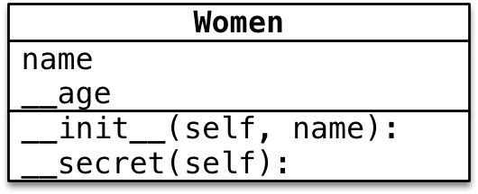
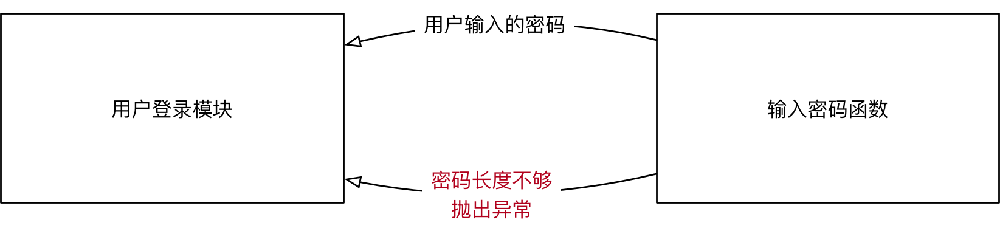

## 面向对象(OOP)基本概念

面向对象编程 —— `Object Oriented Programming` 简写 `OOP`。  
**面向过程** 和 **面向对象**，是两种不同的 **编程方式**。

### 过程和对象
* **过程** 是早期的一个编程概念。
* **过程** 类似于函数，只能执行，但是没有返回值。
* **函数** 不仅能执行，还可以返回结果。

### 面向过程 

1. **面向过程 —— 怎么做？**  
- 把完成某一个需求的所有步骤从头到尾逐步实现。
- 根据开发需求，将某些功能独立的代码封装成一个又一个函数。
- 最后完成的代码，就是顺序地调用不同的函数。

2. **特点**  
- 注重步骤与过程，不注重职责分工。
- 如果需求复杂，代码会变得很复杂。
  - 开发复杂项目，没有固定的套路，开发难度很大！

<div align="center"></div>

### 面向对象 

相比较函数，**面向对象** 是 **更大** 的 **封装** ，根据 **职责** 在 **一个对象中** 封装 **多个方法** 。

1. **面向对象 —— 谁来做**  
- 在完成某一个需求前，首先确定职责 —— 要做的事情（方法）。
- 根据职责确定不同的对象，在对象内部封装不同的方法（多个）。
- 最后完成的代码，就是顺序地让不同的对象 调用不同的方法。

2. **特点**
- 注重对象和职责，不同的对象承担不同的职责。
- 更加适合应对复杂的需求变化，是专门应对复杂项目开发提供的固定套路。
- 需要在面向过程基础上，再学习一些面向对象的语法。


## 类和对象

**类** 和 **对象** 是 **面向对象编程的** 两个 **核心概念** 。

### 类

- **类** 是对一群具有 **相同** **特征** 或者 **行为** 的事物的一个统称，是抽象的，不能直接使用。
    - **特征** 被称为 **属性** 。
    - **行为** 被称为 **方法** 。
- **类** 就相当于制造飞机时的图纸，是一个 **模板**，是 **负责创建对象的**。

### 对象

- **对象** 是 **由类创建出来的一个具体存在**，可以直接使用。  
- 由 **哪一个类** 创建出来的 **对象**，就拥有在 **哪一个类** 中定义的 **属性** 和 **方法** 。  
- **对象** 就相当于用 **图纸** **制造** 的飞机。  
- 在程序开发中，应该 **先有类，再有对象** 。

### 类和对象的关系

- **类是模板，对象** 是根据 **类** 这个模板创建出来的，应该 **先有类，再有对象** 。
- **类** 只有一个，而 **对象** 可以有很多个。
- **不同的对象** 之间 **属性** 可能会各不相同。
- **类** 中定义了什么 **属性和方法** ，**对象** 中就有什么属性和方法，不可能多，也不可能少。

### 类的设计

在使用面向对象开发前，应该首先分析需求，确定一下，程序中需要包含哪些类！
<div align="left"></div>

1. 在程序开发中，要设计一个类，通常需要满足一下三个要素：
      - **类名** 这类事物的名字，满足 **大驼峰命名法**。
          - 每一个单词的首字母大写。
          - 单词与单词之间没有下划线。
      - **属性** 这类事物具有什么样的特征。
      - **方法** 这类事物具有什么样的行为。

2. 属性和方法的确定
      - 对 **对象的特征描述**，通常可以定义成 **属性** 。
      - **对象具有的行为**（动词），通常可以定义成 **方法** 。


## 面向对象基础语法

### dir内置函数

在 `Python` 中 对象几乎是无所不在的，我们之前学习的 **变量、数据、函数** 都是对象，在 `Python` 中可以使用以下两个方法验证：
- 在 **标识符** / **数据** 后输入一个 `.`，然后按下 `TAB` 键，`iPython` 会提示该对象能够调用的 **方法列表** 
- 使用内置函数 `dir` 传入 **标识符** / **数据**，可以查看对象内的 **所有属性及方法**   
  
提示 `__方法名__ `格式的方法是` Python` 提供的 **内置方法** / **属性** 

| 序号 | 方法名 | 类型 | 作用 |
| --- | --- | --- | --- |
| 01 | **\_\_new\_\_** | 方法 | 创建对象时，会被 **自动** 调用 |
| 02 | **\_\_init\_\_** | 方法 | 对象被初始化时，会被 **自动** 调用 |
| 03 | **\_\_del\_\_** | 方法 | 对象被从内存中销毁前，会被 **自动** 调用 |
| 04 | **\_\_str\_\_** | 方法 | 返回对象的描述信息，print 函数输出使用 |

**提示** 利用好 `dir()` 函数，在学习时很多内容就不需要死记硬背了

### 定义简单的类

**面向对象** 是 **更大** 的 **封装**，在 **一个类中** **封装** **多个方法**，这样 **通过这个类创建出来的对象，就可以直接调用这些方法了**！

#### 定义只包含方法的类
- 在 **Python** 中要定义一个只包含方法的类，语法格式如下：

```python
class 类名:
    def 方法1(self, 参数列表):
        pass 
    def 方法2(self, 参数列表):
        pass
```

**方法** 的定义格式和之前学习过的 **函数** 几乎一样，区别在于第一个参数必须是 **self**   
**注意** ：**类名** 的 **命名规则** 要符合 **大驼峰命名法**

#### 创建对象
- 当一个类定义完成之后，要使用这个类来创建对象，语法格式如下：
```python
对象变量 = 类名()
```

#### 例子

```python
# 小猫爱吃鱼，小猫要喝水

class Cat:
    def eat(self):
        print("小猫爱吃鱼")
    def drink(self):
        print("小猫在喝水")

tom = Cat()
tom.drink()
tom.eat()
```

#### 引用概念的强调

在**面向对象**开发中，**引用**的概念是**同样适用**的！

- 在 `Python` 中使用类 **创建对象之后**，`tom` 变量中仍然记录的是 **对象在内存中的地址**，也就是 `tom` 变量 **引用了新建的猫对象**
- 使用 `print` 输出 **对象变量**，默认情况下，是能够输出这个变量 **引用的对象** 是 **由哪一个类创建的对象**，以及 **在内存中的地址（十六进制表示）**

### 方法中的self参数

#### 给对象增加属性

在 `Python` 中，要 **给对象设置属性**，非常的容易，只需要在 **类的外部的代码** 中直接通过 `.` 设置一个属性即可，**但是不推荐使用**，因为**对象属性的封装**应该封装在**类的内部**

```python
tom.name = "Tom"
lazy_cat.name = "大懒猫"
```

#### 使用self在方法内部输出每一只猫的名字

由 **哪一个对象** 调用的方法，方法内的 **`self`** 就是 **哪一个对象的引用**  
- 在类封装的方法内部，**`self`** 就表示 **当前调用方法的对象自己**
- **调用方法时**，程序员不需要传递 **`self`** 参数
- **在方法内部**
    - 可以通过 **`self.`** 访问对象的属性
    - 也可以通过 **`self.`** 调用对象的方法

```python
class Cat:
    def eat(self):
        print("%s 爱吃鱼" % self.name)

tom = Cat()
tom.name = "Tom"
tom.eat()
```

- 在 **类的外部**，通过 **`变量名.`** 访问对象的 **属性和方法**
- 在 **类封装的方法中**，通过 **`self.`** 访问对象的 **属性和方法**

### 初始化方法

#### 初始化方法

- 当使用 **`类名()`** 创建对象时，会 **自动** 执行以下操作：
    1. 为对象在内存中 **分配空间** —— 创建对象
    2. 为对象的属性 **设置初始值** —— 初始化方法(`__init__`)  
- 初始化方法 就是 **`__init__`** 方法，**`__init__`** 是对象的内置方法，专门用来定义一个类具有哪些属性的方法！

#### 在初始化方法内部定义属性

- 在 **`__init__`** 方法内部使用 **`self.属性名 = 属性的初始值`** 就可以 **定义属性**
- 定义属性之后，再使用类创建的对象，都会拥有该属性
- 在定义属性时，如果 **不知道设置什么初始值**，可以设置为 `None`
    - `None` **关键字** 表示 **什么都没有**
    - 表示一个 **空对象，没有方法和属性，是一个特殊的常量**
    - 可以将 `None` 赋值给任何一个变量

```python
class Cat:
    def __init__(self):
        print("这是一个初始化方法")       
        self.name = "Tom"

    def eat(self):
        print("%s 爱吃鱼" % self.name)

# 使用类名()创建对象的时候，会自动调用初始化方法 __init__
tom = Cat()
tom.eat()
```

#### 初始化的同时设置初始值

- 在开发中，如果希望在 **创建对象的同时，就设置对象的属性**，可以对 ` __init__` 方法进行改造
    1. 把希望设置的属性值，定义成 `__init__` 方法的参数
    2. 在方法内部使用 `self.属性 = 形参` 接收外部传递的参数
    3. 在创建对象时，使用 `类名(属性1, 属性2...)` 调用

```python
class Cat:
    def __init__(self, name):
        print("初始化方法 %s" % name)
        self.name = name
    
tom = Cat("Tom")
lazy_cat = Cat("大懒猫")
```

### 内置方法和属性

#### __del__方法

- 在 `Python` 中
    - 当使用 `类名()` 创建对象时，为对象 **分配完空间后**，**自动** 调用 `__init__` 方法
    - 当一个 **对象被从内存中销毁** 前，会 **自动** 调用 `__del__` 方法

- **应用场景**
    - `__init__` 改造初始化方法，可以让创建对象更加灵活
    - `__del__` 如果希望在对象被销毁前，再做一些事情，可以考虑一下 `__del__` 方法

- **生命周期**
    - 一个对象从调用 `类名()` 创建，生命周期开始
    - 一个对象的 `__del__` 方法一旦被调用，生命周期结束
    - 在对象的生命周期内，可以访问对象属性，或者让对象调用方法

```python
class Cat:
    def __init__(self, new_name):
        self.name = new_name
        print("%s 来了" % self.name)

    def __del__(self):
        print("%s 去了" % self.name)

# tom 是一个全局变量
tom = Cat("Tom")
print(tom.name)

# del 关键字可以删除一个对象
del tom
print("-" * 50)
```

#### __str__方法

- 在 `Python` 中，使用 `print` 输出 **对象变量**，默认情况下，会输出这个变量 **引用的对象** 是 **由哪一个类创建的对象**，以及 **在内存中的地址（十六进制表示）**
- 如果在开发中，希望使用 `print` 输出 **对象变量** 时，能够打印 **自定义的内容**，就可以利用 `__str__` 这个内置方法了

**注意**：`__str__` 方法必须返回一个字符串

```python
class Cat:
    def __init__(self, new_name):
        self.name = new_name
        print("%s 来了" % self.name)
    def __del__(self):
        print("%s 去了" % self.name)
    def __str__(self):
        return "我是小猫：%s" % self.name

tom = Cat("Tom")
print(tom)
```

### 身份运算符

身份运算符用于 **比较** 两个对象的 **内存地址** 是否一致 —— **是否是对同一个对象的引用**

- 在 `Python` 中针对 `None` 比较时，建议使用 `is` 判断

| 运算符 | 描述 |	实例 |
| --- | --- | --- |
| is | is 是判断两个标识符是不是引用同一个对象 | `x is y`，类似 `id(x) == id(y)` |
| is not | is not 是判断两个标识符是不是引用不同对象 | `x is not y`，类似 `id(a) != id(b)` |

- `is` 与 `==` 区别：
    - `is` 用于判断 **两个变量** **引用对象是否为同一个**
    - `==` 用于判断 **引用变量的值** **是否相等**

```python
>>> a = [1, 2, 3]
>>> b = [1, 2, 3]
>>> b is a 
False
>>> b == a
True
```


## 私有属性和私有方法

### 应用场景及定义方式

**应用场景**
- 在实际开发中，**对象** 的 **某些属性或方法** 可能只希望 **在对象的内部被使用**，而 **不希望在外部被访问到**
- **私有属性** 就是 **对象不希望公开的属性**
- **私有方法** 就是 **对象不希望公开的方法**

**定义方式**
- 在 **定义属性或方法**时，在 **属性名或者方法名前** 增加 **两个下划线**，定义的就是 **私有属性或方法**

<div align="left"></div>

```python
class Women:
    def __init__(self, name):
        self.name = name
        # 不要问女生的年龄
        self.__age = 18

    def __secret(self):
        print("我的年龄是 %d" % self.__age)

xiaofang = Women("小芳")
# 私有属性，外部不能直接访问
# print(xiaofang.__age)

# 私有方法，外部不能直接调用
# xiaofang.__secret()
```

### 伪私有属性和伪私有方法

`Python` 中，并没有 **真正意义** 的 **私有**
- 在给 **属性、方法** 命名时，实际是对 **名称** 做了一些特殊处理，使得外界无法访问到
- 在 **名称** 前面加上 `_类名` 使变成` _类名__名称`便可以间接访问

```python
# 私有属性，外部不能直接访问到
print(xiaofang._Women__age)

# 私有方法，外部不能直接调用
xiaofang._Women__secret()
```

**注意**：在日常开发中，不要使用这种方式访问对象的 **私有属性** 或 **私有方法**


## 继承

**面向对象三大特性**
- **封装** 根据 **职责** 将 **属性** 和 **方法** **封装** 到一个抽象的 **类** 中
- **继承** **实现代码的重用**，相同的代码不需要重复的编写
- **多态** 不同的对象调用相同的方法，产生不同的执行结果，**增加代码的灵活度**

### 单继承

#### 继承的概念、语法和特点

**继承的概念**：**子类** 拥有 **父类** 的 **所有方法和属性**

<div align="center"></div>

1. 继承的语法

```python
class 类名(父类名):
    pass
```

- **子类** 继承自 **父类**，可以直接享受父类中已经封装好的方法，不需要再次开发
- **子类** 中应该根据 **职责**，封装 **子类特有的** **属性和方法**

2. 专业术语
- `Dog` 类是 `Animal` 类的子类，`Animal` 类是 `Dog` 类的父类，`Dog` 类从 `Animal` 类继承  
- `Dog` 类是 `Animal` 类的派生类，`Animal` 类是 `Dog` 类的基类，`Dog` 类从 `Animal` 类派生

3. 继承的传递性
- `C` 类从 `B` 类继承，`B` 类又从 `A` 类继承
- 那么 `C` 类就具有 `B` 类和 `A` 类的所有属性和方法


#### 方法的重写

**应用场景**  
- 当 **父类** 的方法实现不能满足子类需求时，可以对方法进行 **重写(override)**  
- **重写** 父类方法有两种情况：
    - **覆盖** 父类的方法
    - 对父类方法进行 **扩展**

1. **覆盖父类的方法**  
    - 如果在开发中，**父类的方法实现** 和 **子类的方法实现** 完全不同，就可以使用 **覆盖** 的方式，在子类中 **重新编写** 父类的方法实现
    - 具体的实现方式，就相当于在 **子类中** 定义了一个 **和父类同名的方法并且实现**
    - 重写之后，在运行时，只会调用 **子类中重写的方法**，而不再会调用 **父类封装的方法**

2. **对父类方法进行扩展**  
    - 如果在开发中，**子类的方法实现** 中 **包含父类的方法实现**，即 **父类原本封装的方法** 是 **子类方法的一部分**，就可以使用 **扩展** 的方式
    - 在子类中 **重写** 父类的方法：在需要的位置使用 **`super().父类方法`** 来调用父类方法的执行，代码其他的位置针对子类的需求，编写 **子类特有的代码实现**

#### **关于 super**  
- 在 `Python` 中 `super` 是一个 **特殊的类**，`super()` 就是使用 `super` 类创建出来的对象。  
- `super` 最常使用的场景就是在 **重写父类方法**时，调用 **在父类中封装的方法实现**。  

- 调用父类方法的另外一种方式   
在 `Python 2.x` 时，如果需要调用父类的方法，还可以使用方式：`父类名.方法(self)`  
目前在 `Python 3.x` 还支持这种方式，但不推荐使用，因为一旦 **父类发生变化**，方法调用位置的 **类名** 同样需要修改

- **提示**  
在开发时， `父类名` 和 `super()` 两种方式不要混用  
如果使用 **当前子类名** 调用方法，会形成递归调用，出现死循环

#### **父类的私有属性和私有方法**

- **子类对象不能** 在自己的方法内部，**直接** 访问 **父类的私有属性或私有方法**
- **子类对象** 可以通过 **父类公有方法** **间接** 访问到 **私有属性或私有方法**

**示例**
<div align="left"></div>

- `B` 的对象不能直接访问 `__num2` 属性
- `B` 的对象不能在 `demo` 方法内访问 `__num2` 属性
- `B` 的对象可以在 `demo` 方法内，调用父类的 `test` 方法
- 父类的 `test` 方法内部，能够访问 `__num2` 属性和 `__test` 方法


### 多继承

#### 概念

- **子类** 可以拥有 **多个父类**，并且具有 **所有父类** 的 **属性** 和 **方法**

#### 语法

```python
class 子类名(父类名1, 父类名2...)
    pass
```

#### 多继承的使用注意事项

- 如果 **父类之间** 存在 **同名的属性或者方法**，应该 **尽量避免** 使用多继承

#### Python 中的 MRO —— 方法搜索顺序（知道）

- `Python` 中针对 **类** 提供了一个 **内置属性** `__mro__` ，可以查看 **方法搜索顺序**
- `MRO` 是 `method resolution order`，主要用于 **在多继承时判断方法、属性的调用路径**

```python
In[1]: print(C.__mro__)
Out[1]: (<class '__main__.C'>, <class '__main__.A'>, <class '__main__.B'>, <class 'object'>)
```
- 在搜索方法时，是按照 `__mro__` 的输出结果 **从左至右** 的顺序查找的
- 如果在当前类中找到方法，就直接执行，不再搜索
- 如果没有找到，就查找下一个类中是否有对应的方法，如果找到，就直接执行，不再搜索
- 如果找到最后一个类，还没有找到方法，程序报错

#### 新式类和旧式（经典）类

`object` 是 `Python` 为所有对象提供的 **基类**，提供有一些内置的属性和方法，可以使用 `dir` 函数查看  
- 新式类：以 `object` 为基类的类，推荐使用
- 经典类：不以 `object` 为基类的类，不推荐使用
- 在 `Python 3.x` 中定义类时，如果没有指定父类，会 **默认使用** `object` 作为该类的 基类 —— `Python 3.x` 中定义的类都是 **新式类**
- 在 `Python 2.x` 中定义类时，如果没有指定父类，则不会以 `object` 作为**基类**
- **新式类** 和 **经典类** 在多继承时 **会影响到方法的搜索顺序**  

为了保证编写的代码能够同时在 `Python 2.x` 和 `Python 3.x` 运行，今后在定义类时，如果没有父类，建议统一继承自 `object`

```python
class 类名(object):
    pass
```


## 多态

### 概念
不同的 **子类对象** 调用相同的 **父类方法**，产生不同的执行结果
- **多态** 可以 **增加代码的灵活度**
- 以 **继承** 和 **重写父类方法** 为前提
- 是调用方法的技巧，**不会影响到类的内部设计**

### 多态示例

#### 需求

1. 在 `Dog` 类中封装方法 `game`
    - 普通狗只是简单的玩耍
2. 定义 `XiaoTianDog` 继承自 `Dog`，并且重写 `game` 方法
    - 哮天犬需要在天上玩耍
3. 定义 `Person` 类，并且封装一个 和狗玩 的方法
    - 在方法内部，直接让狗对象调用 `game` 方法

```python
class Dog(object):
    def __init__(self, name):
        self.name = name
    def game(self):
        print("%s 蹦蹦跳跳的玩耍..." % self.name)

class XiaoTianDog(Dog):
    def game(self):
        print("%s 飞到天上去玩耍..." % self.name)

class Person(object):
    def __init__(self, name):
        self.name = name
    def game_with_dog(self, dog):
        print("%s 和 %s 快乐的玩耍..." % (self.name, dog.name))
        # 让狗玩耍
        dog.game()

# 1. 创建一个狗对象
# wangcai = Dog("旺财")
wangcai = XiaoTianDog("飞天旺财")

# 2. 创建一个小明对象
xiaoming = Person("小明")

# 3. 让小明调用和狗玩的方法
xiaoming.game_with_dog(wangcai)     
```

#### 示例小结

- `Person` 类中只需要让狗对象调用 `game` 方法，而不关心具体是什么狗
    - `game` 方法是在 `Dog` 父类中定义的
- 在程序执行时，传入不同的狗对象实参，就会产生不同的执行效果


## 类属性和类方法

### 类的结构

#### 术语——实例

1. 使用面向对象开发，第 1 步 是设计 **类**
2. 使用 **类名()** 创建对象，**创建对象** 的动作有两步：  
    (1) 在内存中为对象 **分配空间**  
    (2) 调用初始化方法 `__init__` 为 **对象初始化**  
3. 对象创建后，**内存** 中就有了一个对象的 **实实在在** 的存在 —— **实例**

<div align="left"></div>

因此，通常也会把：
1. 创建出来的 **对象** 叫做 **类的实例**
2. **创建对象的动作** 叫做 **实例化**
3. **对象的属性** 叫做 **实例属性**
4. **对象调用的方法** 叫做 **实例方法**

在程序执行时：
1. 对象各自拥有自己的 **实例属性**
2. 调用对象方法，可以通过 `self`.
    - 访问自己的属性
    - 调用自己的方法

**结论**  
- **每一个对象** 都有自己 **独立的内存空间**，保存各自不同的属性
- **多个对象的方法，在内存中只有一份**，在调用方法时，**需要把对象的引用** 传递到方法内部

#### 类是一个特殊的对象

**Python中一切皆对象**：
- `class AAA`: 定义的类属于 **类对象**
- `obj1 = AAA()` 属于 **实例对象**

1. 在程序运行时，类同样会被加载到内存
2. 在 Python 中，类是一个特殊的对象 —— **类对象**
3. 在程序运行时，**类对象** 在内存中 **只有一份**，使用一个类可以创建出很多个对象实例
4. 除了封装实例的属性和方法外，**类对象** 还可以拥有自己的属性和方法
    - **类属性**
    - **类方法**
5. 通过 `类名.` 的方式可以 **访问类的属性** 或者 **调用类的方法**

<div align="left"></div>


### 类属性和实例属性

#### 概念和使用

- **类属性** 就是给 **类对象** 中定义的 **属性**
- 通常用来记录 **与这个类相关** 的**特征**
- 类属性不会用于记录具体对象的特征

**示例**  
- 定义一个工具类
- 每件工具都有自己的 `name`
- **需求** —— 知道使用这个类创建了多少个工具对象？

```python
class Tool(object):
    # 使用赋值语句，定义类属性，记录创建工具对象的总数
    count = 0
    def __init__(self, name):
        self.name = name
        # 针对类属性做一个计数+1
        Tool.count += 1

# 创建工具对象
tool1 = Tool("斧头")
tool2 = Tool("榔头")
tool3 = Tool("铁锹")
print("现在创建了 %d 个工具" % Tool.count)
```

#### 属性的获取机制

在 `Python` 中 **属性的获取** 存在一个 **向上查找机制**

<div align="left"></div>

- 因此，要访问类属性有两种方式：
    1. **类名.类属性**
    2. **对象.类属性** （不推荐）

**注意**
- 如果使用 `对象.类属性 = 值` 赋值语句，只会 **给对象添加一个属性**，而 **不会影响到类属性的值**


### 类方法和静态方法

#### 类方法

- **类属性** 就是针对 **类对象** 定义的属性
    - 使用 **赋值语句** 在 `class` 关键字下方可以定义 **类属性**
    - **类属性** 用于记录 **与这个类相关** 的特征
- **类方法** 就是针对 **类对象** 定义的方法
    - 在 **类方法** 内部可以 **直接访问类属性** 或者 **调用其他的类方法**

**语法如下**

```python
@classmethod
def 类方法名(cls):
    pass
```

- 类方法需要用 **修饰器** `@classmethod` 来标识，告诉解释器这是一个类方法
- 类方法的 **第一个参数** 应该是 `cls`
    - 由 **哪一个类** 调用的方法，方法内的 `cls` 就是 **哪一个类的引用**
    - 这个参数和 **实例方法** 的第一个参数是 `self` 类似
    - **提示**  使用其他名称也可以，不过习惯使用 `cls`
- 通过 **`类名.`** 调用 **类方法**，调用方法时，不需要传递 `cls` 参数
- **在方法内部**
    - 可以通过 `cls.` 访问类的属性
    - 也可以通过 `cls.` 调用其他的类方法

**示例**
```python
@classmethod
def show_tool_count(cls):
    """显示工具对象的总数"""
    print("工具对象的总数 %d" % cls.count)
```

#### 静态方法

在开发时，如果需要在**类**中封装一个方法，这个方法既**不需要访问实例属性或者调用实例方法，也不需要访问类属性或者调用类方法**，这个时候，可以把这个方法封装成一个**静态方法**。

**语法如下**
```python
@staticmethod
def 静态方法名():
    pass
```

- **静态方法** 需要用 **修饰器** `@staticmethod` 来标识，告诉解释器这是一个静态方法
- 通过 **`类名.`** 调用 **静态方法**

**示例**
```python
class Dog(object): 
    # 狗对象计数
    dog_count = 0

    @staticmethod
    def run():    
        # 不需要访问实例属性也不需要访问类属性的方法
        print("狗在跑...")

    def __init__(self, name):
        self.name = name      
```

#### 综合示例

**需求**  
1. 设计一个 `Game` 类
2. 属性：
    - 定义一个**类属性** `top_score` 记录游戏的历史最高分
    - 定义一个**实例属性** `player_name` 记录当前游戏的玩家姓名
3. 方法：
    - **静态方法** `show_help` 显示游戏帮助信息
    - **类方法** `show_top_score` 显示历史最高分
    - **实例方法** `start_game` 开始当前玩家的游戏
4. 主程序步骤  
     (1) 查看帮助信息  
     (2) 查看历史最高分  
     (3) 创建游戏对象，开始游戏  

<div align="left"></div>

```python
class Game(object):

    # 游戏最高分，类属性
    top_score = 0

    @staticmethod
    def show_help():
        print("帮助信息：让僵尸走进房间")
        
    @classmethod
    def show_top_score(cls):
        print("游戏最高分是 %d" % cls.top_score)

    def __init__(self, player_name):
        self.player_name = player_name

    def start_game(self):
        print("[%s] 开始游戏..." % self.player_name)
        
        # 使用类名.修改历史最高分
        Game.top_score = 999

# 1. 查看游戏帮助
Game.show_help()

# 2. 查看游戏最高分
Game.show_top_score()

# 3. 创建游戏对象，开始游戏
game = Game("小明")
game.start_game()

# 4. 游戏结束，查看游戏最高分
Game.show_top_score()
```

**小结**  
- **实例方法** —— 方法内部需要访问 **实例属性**
    - **实例方法** 内部可以使用 **`类名.`** 访问 **类属性**
- **类方法** —— 方法内部 **只** 需要访问 **类属性**
- **静态方法** —— 方法内部不需要访问 **实例属性** 和 **类属性**


## 单例

### 单例设计模式

#### 设计模式

- **设计模式** 是 **前人工作的总结和提炼**，通常，被人们广泛流传的设计模式都是针对 **某一特定问题** 的成熟的解决方案
- 使用 **设计模式** 是为了可重用代码、让代码更容易被他人理解、保证代码可靠性

#### 单例设计模式

- 目的 —— 让 **类** 创建的对象，在系统中 只有 **唯一的一个实例**
- 每一次执行 `类名()` 返回的对象，**内存地址是相同的**

#### 单例设计模式应用场景

- 音乐播放对象
- 回收站对象
- 打印机对象
- ……

### __new__方法

- 使用 `类名()` 创建对象时，`Python` 的解释器 首先会调用 `__new__` 方法为对象分配空间
- `__new__` 是一个由 `object` 基类提供的**内置的静态方法**，主要作用有两个：
    1) 在内存中为对象 **分配空间**
    2) 返回 **对象的引用**
- `Python` 的解释器获得对象的 **引用** 后，将引用作为 **第一个参数**，传递给 `__init__` 方法

#### 重写__new__方法（比较固定）

- 重写 `__new__` 方法 一定要 `return super().__new__(cls)`
- 否则 `Python` 的解释器得不到分配了空间的对象引用，就不会调用对象的初始化方法
- 注意：`__new__` 是一个静态方法，在调用时需要主动传递 `cls` 参数

```python
class MusicPlayer(object):

    def __new__(cls, *args, **kwargs):
        # 如果不返回任何结果，
        return super().__new__(cls)

    def __init__(self):
        print("初始化音乐播放对象")

player = MusicPlayer()
print(player)
```

### python中的单例

**单例** —— 让 **类** 创建的对象，在系统中只有 **唯一的一个实例**
1. 定义一个 **类属性**，初始值是 `None`，用于记录单例对象的引用
2. 重写 `__new__` 方法
3. 如果 **类属性** `is None`，调用父类方法分配空间，并在类属性中记录结果
4. 返回 **类属性** 中记录的 **对象引用**

<div align="center"></div>

```python
class MusicPlayer(object):

    # 定义类属性记录单例对象引用
    instance = None

    def __new__(cls, *args, **kwargs):

        # 1. 判断类属性是否已经被赋值
        if cls.instance is None:
            cls.instance = super().__new__(cls)

        # 2. 返回类属性的单例引用
        return cls.instance
```

### 只执行一次初始化动作

- 在每次使用 `类名()` 创建对象时，`Python` 的解释器都会自动调用两个方法：
    - `__new__` 分配空间
    - `__init__` 对象初始化
- 在上一小节对 `__new__` 方法改造之后，每次都会得到 **第一次被创建对象的引用**
- 但是：**初始化方法还会被再次调用**    

#### 需求
- 让 **初始化动作** 只被 **执行一次**

#### 解决方法

1. 定义一个类属性 `init_flag` 标记**是否执行过初始化动作**，初始值为 `False`
2. 在 `__init__` 方法中，判断 `init_flag`，如果为 `False` 就执行初始化动作
3. 然后将 `init_flag` 设置为 `True`
4. 这样，再次自动调用 `__init__` 方法时，初始化动作就不会被再次执行了

```python
class MusicPlayer(object):

    # 记录第一个被创建对象的引用
    instance = None
    # 记录是否执行过初始化动作
    init_flag = False

    def __new__(cls, *args, **kwargs):

        # 1. 判断类属性是否是空对象
        if cls.instance is None:
            # 2. 调用父类的方法，为第一个对象分配空间
            cls.instance = super().__new__(cls)

        # 3. 返回类属性保存的对象引用
        return cls.instance

    def __init__(self):

        if not MusicPlayer.init_flag:
            print("初始化音乐播放器")

            MusicPlayer.init_flag = True

# 创建多个对象
player1 = MusicPlayer()
print(player1)

player2 = MusicPlayer()
print(player2)
```


## 异常

### 异常的概念

- 程序在运行时，如果 `Python` 解释器**遇到**到一个错误，会**停止程序的执行，并且提示一些错误信息**，这就是 **异常**
- **程序停止执行并且提示错误信息** 这个动作，我们通常称之为：**抛出(raise)异常**
- 程序开发时，很难将 **所有的特殊情况** 都处理的面面俱到，通过 **异常捕获** 可以针对突发事件做集中的处理，从而保证程序的稳定性和健壮性

### 捕获异常

#### 简单的捕获异常语法

- 在程序开发中，如果对某些代码的执行不能确定是否正确，可以增加 `try(尝试)` 来 **捕获异常**

```python
try:
    尝试执行的代码
except:
    出现错误的处理
```

- `try` **尝试**，下方编写要尝试代码，不确定是否能够正常执行的代码
- `except` **如果不是**，下方编写尝试失败的代码

**示例**

```python
try:
    # 提示用户输入一个数字
    num = int(input("请输入数字："))
except:
    print("请输入正确的数字")
```

#### 错误类型捕获

- 在程序执行时，可能会遇到 **不同类型的异常**，并且需要 **针对不同类型的异常，做出不同的响应**，这个时候，就需要捕获错误类型了

```python
try:
    # 尝试执行的代码
    pass
except 错误类型1:
    # 针对错误类型1，对应的代码处理
    pass
except (错误类型2, 错误类型3):
    # 针对错误类型2 和 3，对应的代码处理
    pass
except Exception as result:
    print("未知错误 %s" % result)
```

- 当 `Python` 解释器 **抛出异常** 时，**最后一行错误信息的第一个单词，就是错误类型**

**示例**

```python
try:
    num = int(input("请输入整数："))
    result = 8 / num
    print(result)
except ValueError:
    print("请输入正确的整数")
except ZeroDivisionError:
    print("除 0 错误")
```

**捕获未知错误**
- 在开发时，要预判到所有可能出现的错误，还是有一定难度的
- 如果希望程序 **无论出现任何错误**，都不会因为 `Python` 解释器 **抛出异常而被终止**，可以再增加一个 `except`

```python
except Exception as result:
    print("未知错误 %s" % result)
```

#### 异常捕获完整语法

```python
try:
    # 尝试执行的代码
    pass
except 错误类型1:
    # 针对错误类型1，对应的代码处理
    pass
except 错误类型2:
    # 针对错误类型2，对应的代码处理
    pass
except (错误类型3, 错误类型4):
    # 针对错误类型3 和 4，对应的代码处理
    pass
except Exception as result:
    # 打印错误信息
    print(result)
else:
    # 没有异常才会执行的代码
    pass
finally:
    # 无论是否有异常，都会执行的代码
    print("无论是否有异常，都会执行的代码")
```

- `else` 只有在没有异常时才会执行的代码
- `finally` 无论是否有异常，都会执行的代码

**示例**

```python
try:
    num = int(input("请输入整数："))
    result = 8 / num
    print(result)
except ValueError:
    print("请输入正确的整数")
except ZeroDivisionError:
    print("除 0 错误")
except Exception as result:
    print("未知错误 %s" % result)
else:
    print("正常执行")
finally:
    print("执行完成，但是不保证正确")
```

### 异常的传递

- **异常的传递** —— 当函数/方法执行出现异常，会将异常传递给函数或方法的调用一方
- 如果传递到主程序，仍然没有异常处理，程序才会被终止

**提示**
- 在开发中，可以在主函数中增加 **异常捕获**
- 而在主函数中调用的其他函数，只要出现异常，都会传递到主函数的 **异常捕获** 中
- 这样就不需要在代码中，增加大量的 **异常捕获**，能够保证代码的整洁

**示例**

```python
def demo1():
    return int(input("请输入一个整数："))

def demo2():
    return demo1()

try:
    print(demo2())
except ValueError:
    print("请输入正确的整数")
except Exception as result:
    print("未知错误 %s" % result)
```

### 抛出 raise 异常

#### 应用场景

- 在开发中，除了 **代码执行出错** `Python` 解释器会 **抛出** 异常之外
- 还可以根据 **应用程序** **特有的业务需求** **主动抛出异常**

**示例**
- 提示用户 **输入密码**，如果 **长度少于8**，抛出**异常**

<div align="center"></div>

**注意**
- 当前函数只负责提示用户输入密码，如果 **密码长度不正确，需要其他的函数进行额外处理**
- 因此可以 **抛出异常**，由其他需要处理的函数 **捕获异常**

#### 抛出异常

- `Python` 中提供了一个 `Exception` **异常类**
- 在开发时，如果满足 **特定业务需求时，希望抛出异常**，可以：
    - 创建 一个 `Exception` 的 **对象**
    - 使用 `raise` 关键字 抛出 **异常对象**

**需求**
- 定义 `input_password` 函数，提示用户输入密码
- 如果用户输入长度 < 8，抛出异常
- 如果用户输入长度 >=8，返回输入的密码

```python
def input_password():
    # 1. 提示用户输入密码
    pwd = input("请输入密码：")

    # 2. 判断密码长度，如果长度 >= 8，返回用户输入的密码
    if len(pwd) >= 8:
        return pwd

    # 3. 密码长度不够，需要抛出异常
    # 1> 创建异常对象 - 使用异常的错误信息字符串作为参数
    ex = Exception("密码长度不够")

    # 2> 抛出异常对象
    raise ex

try:
    user_pwd = input_password()
    print(user_pwd)
except Exception as result:
    print("发现错误：%s" % result)
```


## 模块和包

### 模块

#### 模块的概念

- **模块**是 `Python` 程序架构的一个**核心概念**
- 每一个以扩展名 `py` 结尾的 `Python` 源代码文件都是一个 **模块**
- **模块名** 同样也是一个 **标识符**，需要符合标识符的命名规则
- 在模块中定义的 **全局变量、函数、类** 都是提供给外界直接使用的 **工具**
- **模块** 就好比是 **工具包**，要想使用这个工具包中的工具，就需要先 **导入** 这个模块

#### 模块导入的两种方式

1. import导入

```python
import 模块名1, 模块名2 

# 提示：在导入模块时，每个导入应该独占一行
import 模块名1
import 模块名2
```

导入之后通过 `模块名.` 使用模块提供的工具 —— 全局变量、函数、类

**使用 as 指定模块的别名**
- 如果模块的名字太长，可以使用 `as` 指定模块的名称，以方便在代码中的使用
```python
import 模块名1 as 模块别名
```

2. from...import 导入
- 如果希望 **从某一个模块** 中，导入 **部分** 工具，就可以使用 `from ... import` 的方式
- `import 模块名` 是 **一次性** 把模块中 **所有工具全部导入**，并且通过 **模块名/别名** 访问

```python
# 从 模块 导入 某一个工具
from 模块名1 import 工具名
```

导入之后，**不需要**通过 `模块名.` 使用，可以直接使用**模块提供的工具 —— 全局变量、函数、类**

**注意** ：如果 **两个模块**，存在 **同名的函数**，那么 **后导入模块的函数**，会 **覆盖掉先导入的函数**
- 开发时 `import` 代码应该统一写在 **代码的顶部**，更容易及时发现冲突
- 一旦发现冲突，可以使用 `as` 关键字 **给其中一个工具起一个别名**

#### 模块的搜索顺序

`Python` 的解释器在 **导入模块** 时，会：
- 搜索 **当前目录** 指定模块名的文件，如果有就直接导入
- 如果没有，再搜索 **系统目录**
- `Python` 中每一个模块都有一个内置属性 `__file__` 可以查看模块的完整路径

**示例**
```python
import random
# 生成一个 0～10 的数字
rand = random.randint(0, 10)
print(rand)
```

**注意**：如果当前目录下，存在一个 `random.py` 的文件，程序就无法正常执行了！这个时候，`Python` 的解释器会加载当前目录下的 `random.py` 而不会加载系统的 `random` 模块。

#### 原则——每一个文件都应该是可以被导入的

- 一个 独立的 `Python` 文件就是一个 **模块**
- 在导入文件时，文件中 **所有没有任何缩进的代码** 都会被执行一遍！

**实际场景**
- 在实际开发中，每一个模块都是独立开发的，大多都有专人负责
- 开发人员通常会在模块下方增加一些测试代码，**仅在模块内使用，而被导入到其他文件中不需要执行**

**__name__属性**
- `__name__` 是 `Python` 的一个内置属性，记录着一个字符串
- 如果是被其他文件导入的，`__name__` 就是 `模块名`
- 如果是当前执行的程序 `__name__` 是 `__main__`

```python
# 导入模块
# 定义全局变量
# 定义类
# 定义函数

# 在代码的最下方
def main():
    # ...
    pass

# 根据 __name__ 判断是否执行下方代码
if __name__ == "__main__":
    main()
```

### 包（Package）

#### 概念

- **包** 是一个 **包含多个模块** 的 **特殊目录**
- 目录下有一个 **特殊的文件** `__init__.py`
- 包名的命名方式和变量名一致，`小写字母 + _`
- 使用 `import 包名` 可以一次性导入包中所有的模块
- 要在外界使用 包中的模块，需要在 `__init__.py` 中指定 **对外界提供的模块列表**
```python
# 从 当前目录 导入 模块列表
from . import send_message
from . import receive_message
```

### 发布模块

- 如果希望自己开发的模块，分享给其他人，可以按照以下步骤操作

#### 制作发布压缩包步骤

1. 创建 `setup.py`

```python
from distutils.core import setup

setup(name="hm_message",  # 包名
      version="1.0",  # 版本
      description="itheima's 发送和接收消息模块",  # 描述信息
      long_description="完整的发送和接收消息模块",  # 完整描述信息
      author="itheima",  # 作者
      author_email="itheima@itheima.com",  # 作者邮箱
      url="www.itheima.com",  # 主页
      py_modules=["hm_message.send_message",
                  "hm_message.receive_message"])
```

有关字典参数的详细信息，可以参阅官方网站：[链接](https://docs.python.org/2/distutils/apiref.html)

2. 构建模块
```python
$   python3 setup.py build
```

3. 生成发布压缩包
```python
$ python3 setup.py sdist
```
注意：要制作哪个版本的模块，就使用哪个版本的解释器执行！

#### 安装模块
```python
$ tar -zxvf hm_message-1.0.tar.gz 
$ sudo python3 setup.py install
```
**卸载模块**：直接从安装目录下，把安装模块的目录删除就可以


## 文件

### 文件的存储方式

- 在计算机中，文件是以 二进制 的方式保存在磁盘上的

**文本文件和二进制文件**
- 文本文件
    - 可以使用文本编辑软件查看
    - 本质上还是二进制文件
    - 例如：python 的源程序

- 二进制文件
    - 保存的内容不是给人直接阅读的，而是提供给其他软件使用的
    - 例如：图片文件、音频文件、视频文件等等
    - 二进制文件不能使用文本编辑软件 查看

### 文件的基本操作

#### 操作文件的套路

在计算机中要操作文件的套路非常固定，一共包含三个步骤：
1. 打开文件
2. 读、写文件
    - **读** 将文件内容读入内存
    - **写** 将内存内容写入文件
3. 关闭文件

#### 操作文件的函数/方法

在 `Python` 中要操作文件需要记住 1 个函数和 3 个方法

| 序号 | 函数/方法 | 说明 |
| --- | --- | --- |
| 01 | open | 打开文件，并且返回文件操作对象 |
| 02 | read	| 将文件内容读取到内存 |
| 03 | write | 将指定内容写入文件 |
| 04 | close | 关闭文件 |

- `open` 函数负责打开文件，并且返回文件对象
- `read/write/close` 三个方法都需要通过文件对象来调用

#### read 方法 —— 读取文件

- `open` 函数的第一个参数是要打开的文件名（文件名区分大小写）
    - 如果文件存在，返回文件操作对象
    - 如果文件不存在，会抛出异常
- `read` 方法可以一次性读入并返回文件的所有内容
- `close` 方法负责关闭文件
    - 如果忘记关闭文件，会造成系统资源消耗，而且会影响到后续对文件的访问

注意：`read`方法执行后，会把文件指针移动到文件的末尾

```python
# 1. 打开 - 文件名需要注意大小写
file = open("README")

# 2. 读取
text = file.read()
print(text)

# 3. 关闭
file.close()
```

**文件指针**
- 文件指针标记从哪个位置开始读取数据
- 第一次打开文件时，通常文件指针会指向文件的开始位置
- 当执行了 `read` 方法后，文件指针会移动到读取内容的末尾
    - 默认情况下会移动到文件末尾

**注意**：如果执行了一次 `read` 方法，读取了所有内容，那么再次调用 `read` 方法，不会读取内容。因为第一次读取之后，文件指针移动到了文件末尾，再次调用不会读取到任何的内容。

#### 打开文件的方式

`open` 函数默认以 **只读方式** 打开文件，并且返回文件对象  
语法如下：

```python
f = open("文件名", "访问方式")
```

| 访问方式 | 说明 |
| :---: | --- |
| r	| 以只读方式打开文件。文件的指针将会放在文件的开头，这是默认模式。如果文件不存在，抛出异常 |
| w	| 以只写方式打开文件。如果文件存在会被覆盖。如果文件不存在，创建新文件 |
| a	| 以追加方式打开文件。如果该文件已存在，文件指针将会放在文件的结尾。如果文件不存在，创建新文件进行写入 |
| r+ | 以读写方式打开文件。文件的指针将会放在文件的开头。如果文件不存在，抛出异常 |
| w+ | 以读写方式打开文件。如果文件存在会被覆盖。如果文件不存在，创建新文件 |
| a+ | 以读写方式打开文件。如果该文件已存在，文件指针将会放在文件的结尾。如果文件不存在，创建新文件进行写入 |

**提示**   
- 频繁的移动文件指针，会影响文件的读写效率，开发中更多的时候会以 **只读、只写** 的方式来操作文件

**写入文件示例：**

```python
# 打开文件
f = open("README", "w")

f.write("hello python！\n")
f.write("今天天气真好")

# 关闭文件
f.close()
```

#### 按行读取文件内容

- `read` 方法默认会把文件的 **所有内容一次性读取到内存**
- 如果文件太大，对内存的占用会非常严重

**`readline` 方法**
- `readline` 方法可以一次读取一行内容
- 方法执行后，会把文件指针移动到下一行，准备再次读取

**读取大文件的正确姿势**

```python
# 打开文件
file = open("README")

while True:
    # 读取一行内容
    text = file.readline()

    # 判断是否读到内容
    if not text:
        break

    # 每读取一行的末尾已经有了一个 `\n`
    print(text, end="")

# 关闭文件
file.close()
```

### 文件/目录的常用管理操作

- 在终端/文件浏览器中可以执行常规的文件/目录管理操作，例如：
    - 创建、重命名、删除、改变路径、查看目录内容、……
- 在 `Python` 中，如果希望通过程序实现上述功能，需要导入 `os` 模块

#### 文件操作

| 序号 | 方法名 | 说明 | 示例 |
| --- | --- | --- | --- |
| 01 | rename | 重命名文件 | os.rename(源文件名, 目标文件名) |
| 02 | remove |	删除文件 | os.remove(文件名) |

#### 目录操作

| 序号 | 方法名 | 说明 | 示例 |
| --- | --- | --- | --- |
| 01 |	listdir	| 目录列表 | os.listdir(目录名) |
| 02 |	mkdir | 创建目录 | os.mkdir(目录名) |
| 03 |	rmdir | 删除目录 | os.rmdir(目录名) |
| 04 |	getcwd | 获取当前目录 |	os.getcwd() |
| 05 |	chdir |	修改工作目录 | os.chdir(目标目录) |
| 06 |	path.isdir | 判断是否是文件 | os.path.isdir(文件路径) |

**提示**
- 文件或者目录操作都支持相对路径和绝对路径


## eval 函数

`eval()` 函数十分强大 —— 将字符串当成有效的表达式来求值并返回计算结果

```python
# 基本的数学计算
In [1]: eval("1 + 1")
Out[1]: 2

# 字符串重复
In [2]: eval("'*' * 10")
Out[2]: '**********'

# 将字符串转换成列表
In [3]: type(eval("[1, 2, 3, 4, 5]"))
Out[3]: list

# 将字符串转换成字典
In [4]: type(eval("{'name': 'xiaoming', 'age': 18}"))
Out[4]: dict
```

**注意**
- 在开发时千万不要使用 `eval` 直接转换 `input` 的结果

