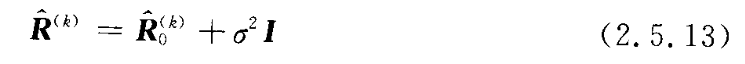
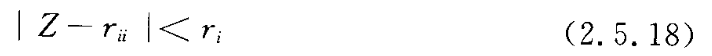
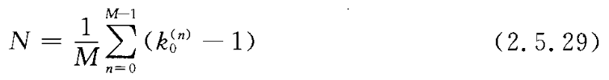

- 为什么信号源数的不同会对空间谱曲线带来如此大的影响？  
  这主要是因为，大多数空间谱估计算法都是基于特征子空间的算法，也就是充分利用了信号子空间与噪声子空间的正交性，而当信号源数估计不准时，也就是信号子空间、噪声子空间估计不准，即两者之间不完全正交，就会造成估计信号源时的漏警或虚警，也就会造成在估计信号方向时的偏差。

- 在一定的条件下数据协方差矩阵的大特征值数对应于信号源数，而其他的小特征值是相等的（等于噪声功率）。这说明可以直接根据数据协方差矩阵的大特征值来判断信号的源数，但在实际应用场合（包括数据仿真），由于快拍数据、信噪比等方面的限制，对实际得到的数据协方差矩阵进行特征分解后，不可能得到明显的大小特征值。如何才能从分别不明显的特征值中进行判断？一种经典的方法就是通过似然比来确定门限（假设检验法），但这种方法有一个明显的缺点就是门限的判断带有明显的主观性。  
针对上述方法的缺点，很多学者提出了在信号数目估计方面较为有效的方法，包括 **信息论方法、平滑秩法、矩阵分解法、盖氏圆方法以及正则相关等方法** 。

- 二范数指矩阵A的2范数，就是A的转置共轭矩阵与矩阵A的积的最大特征根的平方根值，是指空间上两个向量矩阵的直线距离。类似于求棋盘上两点间的直线距离。
    - 矩阵范数：矩阵A的2范数就是 A的转置乘以A矩阵的结果的特征根最大值的开根号；
    - 向量范数：向量x的2范数是x中各个元素平方之和再开根号；
    - 函数范数：函数f(x)的2范数是x在区间（a,b）上f(x)的平方的积分再开根号。

## 信息论方法

- 估计一致性（stimatinn rnasisteut），也称一致的估计。是指当样本容量趋于无穷大时，样本的数字特征依概率收敛于相应总体的数字特征。即用容量较大的样本比容量较小的样本作出的估计值要更精确，随着样本容量的增大估计值与待估参数接近的可能性就越大，估计值的这种特性称为估计的一致性。如算术平均值 ,就是总体平均值的一致性估计值，样本方差就是总体方差的一致性估计值。

- 信息论准则估计信号源数目时，只能对独立信号源的综述作出估计，当信号源相干时，则无法正确估计信号源数，而且对信号源的类别和结构不能作出判断，如其中有几组独立信号源，且每组信号源中有多个相干信号源的情况。

信息论的方法有 **Akaike 信息论（AIC）准则、最小描述长度（MDL）准则及有效检测（EDC）准则** 等方法。

信息论的方法有一个统一的表达形式

$~~~~~$ 式中，$L(k)$ 是对数似然函数，$p(k)$ 是罚函数。通过对 $L(k)$ 和 $p(k)$ 的不同选择就可以得到不同的准则。下面介绍 EDC 信息论准则，有

$~~~~~$ 式中， $n$ 为待估计的信号源数（自由度），$L$ 为采样数，其中 $\Lambda (n)$ 为似然函数，且

$~~~~~$ 式（2.5.2）中的 $C(L)$ 需满足如下条件：

$~~~~~$ 当 $C(L)$ 满足上述条件时，准则 EDC 具有估计一致性。

$~~~~~$ 在式（2.5.2）中选择 $C(L)$ 分别为 $1,~~(lnL)/2,~~(ln~lnL)/2$ 时，就可以得到 AIC，MDL，HQ　等准则，即

$~~~~~$ 下面通过仿真来比较 AIC 准则、MDL 准则及 HQ 准则的估计性能。实验针对3个独立信号源，线性均匀阵列的阵元数为8，快拍数为200，信号入射方向为5°，30°和50°，阵元间距为半波长，独立实验100次。仿真结果如图。

结合文献，从上述仿真中可以得出如下的结论。

1. AIC 准则不是一致性估计（显然 $C(L)=1$ 时不满足上述的第二个条件），即在大块拍数的场合，它仍然有较大的误差概率；而 MDL 准则相对较好； HQ 准则居于两者之间，主要原因是由准则中的罚函数项引起的。
2. MDL 准则是一致性估计，也就是在高信噪比情况下该准则有较好的性能，但在小信噪比情况下该准则相比 AIC 有较高的误差概率，在大信噪比情况下其误差概率比 AIC 准则小。
3. EDC 准则中 $C(L)$ 取下式时：

$~~~~~$ EDC 准则也就是 MDL 准则，所以说 MDL 准则是 EDC 准则的一种特例。

4. EDC 准则中 $C(L)$ 取下式时：
  

$~~~~~$ EDC 准则就是 HQ 准则，所以说 HQ 准则也是 EDC 准则的一种特例。从信噪比角度而言，这三种准则中 HQ 准则最优，其次是 AIC 。

## 平滑秩序列法

$~~~~~$ 阵列对信号分辨能力与阵元数 $M$ 、信号的相关性及算法有关。对于独立信号的分辨能力，阵元数 $M$ 应大于独立源数，即 $M \ge K+1$ ；对于前向（或后向）空间平滑法，应满足 $M \ge K + J_1$ ，式中 $K$ 是总源数， $J_1$ 是相关源数目；对于双向平滑算法，$M \ge K + \frac{1}{2} J_1$  
$~~~~~$ 设 $R_0$ 是 $M×M$ 维矩阵，$k$ 是正整数，定义一个 $(M-k)×M$ 维矩阵 $I_{M-k,j}$ 
  

它的前 $j$ 列和后 $k-j$ 列为 $\pmb{0}$ 矢量，$\pmb{I}$ 为单位矩阵。将 $\pmb{R_0}$ 分成交叉重叠矩阵 $\{{R_0}^{(i)}\}_{i=1}^{M-1}$ ，即

上式中的交叉重叠矩阵序列实质上是前向空间平滑矩阵。  

- $\pmb{I}_{M-k,j} \pmb{R_0} \pmb{I}_{M-k,j}^T$ 的作用：从 $\pmb{R_0}$ 中选出 $(M-k)×(M-k)$ 子阵  
- $\pmb{I}_{M-k,j}=\begin{bmatrix}\pmb{0}&\cdots&\pmb{0}&\pmb{I}&\pmb{0}&\cdots&\pmb{0}\end{bmatrix}_{(M-k)×M}~~~~~~$   
注：因为 $\pmb{I}$ 是 $(M-k)×(M-k)$ 单位阵，前面是 $j$ 列，所以后面是 $M-j-(M-k)=k-j$   
$~~~~~$
- $\pmb{R_0}=\begin{bmatrix}R_{11}&\cdots&R_{1M}\\ \vdots&\vdots&\vdots \\ R_{M1}&\cdots&R_{MM}\end{bmatrix}_{M×M}$  
$~~~~~$
- $\pmb{I}_{M-k,j} \pmb{R_0} \pmb{I}_{M-k,j}^T = \begin{bmatrix}R_{(j+1)(j+1)}&\cdots&R_{(j+1)(j+M-k)} \\ \vdots&\vdots&\vdots \\ R_{(j+M-k)(j+1)}&\cdots&R_{(j+M-k)(j+M-k)} \end{bmatrix}_{(M-k)×(M-k)}$

$~~~~~$  假设信号源由 $L$ 组相关源的群组成，分别表示为 $g_i(i=1,2,\cdots,L)$ 如 $i=1$ 则表明该群是单个独立信号；$i=3$ 说明该群有三个相干源，$L$ 是最大的相关源数。若 $g_2=3$ 则说明有三个相关群，每群有两个相干源，则相关群的数目为

$~~~~~$ 总的信号源数为

$~~~~~$ 式中，$f_q$ 表示第 $q$ 组相关群的信号源数。  
$~~~~~$ 如果从有限次快拍的数据中获得数据协方差矩阵，此时

$~~~~~$ 而 $\pmb{\hat{R}}_{(k)}$ 的信号子空间维数就是 $\pmb{\hat{R}}_{(k)}$ 的秩，故平滑秩序列为

$~~~~~$ 同时，根据 MDL 准则可得

$~~~~~$ 根据式（2.5.14）和式（2.5.15）可以求得信号源的相关结构及信号源数。显然上述的平滑秩算法很容易推广到双向平滑秩算法，这时平滑秩序列只需作如下修正：

经上述分析，对平滑秩算法作一总结，如算法2.5.1所示。

- 对于算法2.5.1，说明如下：  
    1. 算法中当 $k=0$ ，其实就是求原协方差矩阵维数。随着 $k$ 的增加也就是对原协方差矩阵求 $k$ 次前向或后向平滑后，再对修正的协方差矩阵求维数。
    2. 如果上述算法改为双向平滑，即每次 $k$ 对协方差矩阵进行双向平滑，再求修正矩阵的维数，则得到的就是双向平滑秩算法。
    3. 信号源数及相关结构均是根据平滑秩序列来判断的，一般情况下 $k=0$ 时的矩阵维数为独立组数，平滑秩中最大的数即为信号源数。

$~~~~~$ 平滑秩算法是基于解相干基础的信号源数估计问题，所以其他的解相干处理算法同样也可以实现信号源数的估计问题，如矩阵分解方法等。矩阵分解算法估计信号源数的处理过程与上述的平滑秩算法基本相同，即都是对不同维数的解相干矩阵估计信号源数并组成一个序列。不同之处在于对于解相干的过程，平滑秩是采用平滑之后的矩阵解相干，而矩阵分解方法是采用矩阵重构的方法解相干。  
$~~~~~$ 这类基于解相干基础的信号源数估计方法，与信息论方法相比有如下优点：当信噪比比较大、快拍数较大时，平滑秩序列法比 AIC 及 HQ 算法的性能要好；当入射信号包括几个相干源群时，平滑秩算法不但可以估计出信号源总数，而且还可以估计出信号源结构，信息论方法只能估计信号源数，无法对结构进行估计。

## 盖氏圆方法

- 盖氏圆方法，一种不需要具体知道特征值数值的信号源数估计方法，即利用 Gerschgorin 圆盘定理，就可估计出各特征值的位置，进而估计出信号源。

**定理2.5.1**  $~~~~$  设有一 $M×M$ 维矩阵 $R$ ，其第 $i$ 行第 $j$ 列的元素为 $r_{ij}$，令第 $i$ 行元素（除第 $i$ 列元素）绝对值之和为

$~~~~~$ 定义第 $i$ 个圆盘 $O_i$ 上的点在复平面上的集合用下式表示：

$~~~~~$ 这个圆盘称之为盖氏圆盘。矩阵 $R$ 的特征值包含在圆盘 $O_i$ 的并区间内，圆盘的中心位于 $r_{ij}$ 处，半径为 $r_i$ （称之为盖氏半径）。  
$~~~~~$ 在利用盖氏圆盘估计信号源数时，通常需要对数据协方差矩阵进行酉变换。当然这个变换的目的是使信号和噪声的圆盘分开，因为信号的圆盘半径较大，它包含有 $N$ 个信号源对应的特征值；而噪声的圆盘半径较小，它包含有 $M-N$ 个与噪声对应的特征值。如果我们对数据协方差矩阵进行分块

$~~~~~$ 为了简单起见，我们通常取 $M-1$ 维方阵 $\pmb{\hat{R}}^{'}$ 的特征空间（即特征矩阵 $\pmb{\hat{U}}$，满足 $\pmb{\hat{U}\hat{U}}^H=\pmb{I}$，且 $\pmb{\hat{R}}^{'}=\pmb{\hat{U}~\sum ~\hat{U}}^H$）构成一个酉变换矩阵 $\pmb{T}$

$~~~~~$ 这样酉变换之后的矩阵为

**注**
- $\pmb{\hat{U}}=\begin{bmatrix}\pmb{\hat{e_1}}&\pmb{\hat{e_2}}&\cdots&\pmb{\hat{e_M}}\end{bmatrix}_{(M-1)×(M-1)}$  

- $\pmb{\hat{r_i}}=\begin{bmatrix}\hat{r_{i1}}&\cdots&\hat{r_{i(i-1)}}&\hat{r_{i(i+1)}}&\cdots&\hat{r_{iM}}\end{bmatrix}$

$~~~~~$  
显然，式（2.5.21）中有

式（2.5.22）中 $A$ 为前 $M-1$ 个阵元的阵列流型，$\pmb{\hat{R_s}}$ 为信号的协方差矩阵，且有

所以，盖氏圆的半径满足如下不等式：

$~~~~~$ 其中， $k=|\pmb{\hat{R}_S}\pmb{b^{*}_M}|$ 与 $i$ 无关。这就说明盖氏圆半径只决定于 $|\pmb{\hat{e_i}}^H\pmb{A}|$，若式（2.5.24）中的特征矢量对应噪声特征矢量（理想情况下其与阵列流型正交），则盖氏圆半径将很小；若式（2.5.24）中特征矢量对应信号特征矢量，显然其半径值将比零大，这样就可以确定判断信号源数的准则

$~~~~~$ 式中，$D(L)$ 是一个与快拍数有关的调整因子，它在 $1$ 与 $0$ 之间选取，当快拍数趋于无穷时其取 $0$ ；$k$ 的取值范围为 $1 \sim M-2$ 当 $k$ 从小到大时，假设 GDE(k) 第一次出现负数时的数为 $k_0$ ，则源数为 $N=k_0-1$ 。  
$~~~~~$ 从上面的分析过程可以看出，盖氏圆半径法的估计精度由特征矢量 $\pmb{\hat{e_i}}$ 及第 $i$ 个阵元与第 $M$ 个阵元相关函数来决定。为了提高估计精度，矢量 $\pmb{\hat{r}}$ 可以由任意两阵元的相关函数来代替，这样就可以得到 $M$ 个不同的酉变换矩阵 $\pmb{T}$ 。假设存在如下一个交换矩阵：

$~~~~~$ 于是可以得到 $M$ 个修正的酉矩阵

$~~~~~$ 式中，$\pmb{T}^{(0)}$ 为式（2.5.20）所示的 $\pmb{T}$ 。因此，判断信号源数准则可以作如下修正：

$~~~~~$ 然后对 $M$ 次计算的结果进行平均，可得修正的盖氏圆方法的信号源数

$~~~~~$ 下面总结一下盖氏圆估计信号源数的方法，见算法2.5.2。

$~~~~~$ 说明：上述算法中，如果只计算 $n=0$ ，就是常规的盖氏圆算法，称之为 GDE 算法；当 $n>0$，就是修正的盖氏圆算法，称之为 MGDE 算法。另外，算法中第 6 步判断信号源数，就是将式（2.5.28）这个系列中第一个小于零的位置减 1 得到信号源数。

$~~~~~$ 下面通过仿真比较平滑秩算法(SS)，矩阵分解算法(MD)、盖氏圆半径法(GDE) 和修正的盖氏圆半径法(MGDE) 算法的性能。实验针对 3 个独立信号源，线性均匀阵列的阵元数为 8 ，快拍数为200 ，信号入射方向为 5°、30° 和 50°，阵元间距为半波长，独立实验 100 次。仿真结果见图2.5.3。

从图2.5.3可以看出在低信噪比情况下，盖氏圆方法的性能优于平滑秩算法和矩阵分解算法，但在高信噪比情况下，平滑秩算法和矩阵分解算法的稳定性明显优于盖氏圆算法。

## 正则相关技术

$~~~~~$ 前面介绍的信号源数的估计方法都是针对高斯白噪声背景对入射信号源数进行估计。当噪声中有色成分加大时，这些算法性能会下降很快。针对这种情形，下面介绍针对色噪声情况下的信号源估计方法——正则相关技术（CCT）。  
$~~~~~$ 假设 $k$ 个独立窄带信号源从不同方向入射到两个空间分离的阵列，每个阵列分别有 $p$ 和 $q$ 个阵元，则阵列接收数据

$~~~~~$ 式中，$\pmb{v_x}$ 和 $\pmb{v_y}$ 是两个不同阵列接收的色噪声，相互之间独立。假设

$~~~~~$ 则整个阵列的数据协方差矩阵为

$~~~~~$ 下面定义如下一个矩阵并对其进行奇异值分解，有

$~~~~~$ 式中，$\pmb{U,V}$ 分别是左右奇异矩阵，$\pmb{\Gamma}$ 为奇异值组成的对角阵，则显然有

$~~~~~$ 且奇异值满足如下关系：

$~~~~~$ 式（2.5.35）中的奇异值也称为正则相关因子，正则相关因子在特定条件下满足如下的 Bartlett's 近似：当接收数据满足高斯分布，且满足条件 $\sigma_1 \ne 0,~\sigma_2 \ne 0,~\cdots,~\sigma_n \ne 0,~\sigma_{n+1}=~\cdots=~\sigma_p~=~0(n\le p)$ ，定义如下系列：

$~~~~~$ 则系列 $\begin{Bmatrix}c(n),n=1,2,\cdots,p-1\end{Bmatrix}$ 是自由度为 $2(p-n)(q-n)$ 近似 $\chi^2$ 分布。
$~~~~~$ 显然，利用上述正则相关因子的特性，就可以用来判断信号源数。不过由式（2.5.36）定义的系列是一个近似 $\chi^2$ 分布，所以另外需要确定一个判决门限 $T_n$ ，当然这个判决门限是通过虚警概率得到的，即

$~~~~~$ 显然，通过虚警概率 $P_f$ 可以预先得到判决门限 $\begin{Bmatrix}T_n,n=1,2,\cdots,p-1\end{Bmatrix}$ 。
$~~~~~$ 下面归纳一下 CCT 算法，见算法2.5.3。

$~~~~~$ 说明，上述 CCT 算法的第 5 步是将式（2.5.36）所示的系列与对应的各门限比较，则第一个小于门限的位置数减 1 即为信号源数。其中门限的计算是关键，门限由虚警概率和 $\chi^2$ 分布这两个已知条件很容易得出。
$~~~~~$ 下面通过仿真比较正则相关算法（CCT），AIC，MDL 及盖氏圆半径法（GDE）的性能。实验针对 3 个独立信号源，线性均匀阵列的阵元数为 8，快拍数为 200，信号入射方向为 5°，30° 和 50°，阵元间距为半波长，独立实验 100 次，其中 CCT 算法的虚警概率为 0.01 。仿真结果见图2.5.4，其中图2.5.4(a) 是针对白噪声背景下各种算法的性能，图2.5.4(b) 针对色噪声背景下各种算法的性能。  
$~~~~~$ 从图2.5.4可以清楚地看出，在色噪声背景下 CCT 算法和盖氏圆半径法均能较好地估计信号源数，而信息论准则则无法准确估计信号源数；在白噪声背景下 CCT 算法性能与 AIC 准则接近。

## 小结

通过对信号源数估计问题的讨论及对几种典型估计方法的仿真实验分析，可以得出如下主要结论。  
1. 入射信号在白噪声情况下，利用 CCT 准则估计信号源数在高信噪比下性能很好，低信噪比下也明显地比 MDL、盖氏圆、平滑秩及矩阵分解类方法性能要好。
2. CCT 算法具有鲁棒性。在有色噪声环境下，可以设定不同的门限值，即虚警概率，在噪声不同时可以调节。而信息论准则则无法在色噪声背景下准确估计信号源数。
3. CCT 算法的条件时两阵列噪声间不相关，实际上即使相关，估计性能也下降不多。如当两阵列噪声相关系数为 0.35 时，在性能上比相关系数为0时大致下降了 2dB 左右。
4. 平滑秩、矩阵分解算法在低信噪比情况下性能较差，但在高信噪比下算法相当稳定，在色噪声背景下它们也能估计信号源数，而且这类算法可以实现信号源结构和源数的同时估计。
5. GDE，MGDE 算法在低信噪比情况下性能差于 CCT 及信息论准则，但优于 SS，MD 算法，盖氏圆的方法也能用于色噪声背景下的信号源数估计。
6. AIC 准则不是一致性估计，即在大快拍数的场合，它仍然有较大的误差概率；而 MDL 准则是一致性估计，在高信噪比情况下该准则有较好的性能，但在小信噪比情况下该准则比 AIC 有高的误差概率；MDL 准则相对较好，HQ 准则居于两者之间。
