## 前向空间平滑法

$~~~~~~$ 将 $M$ 个阵元的均匀线阵，分成相互交错的 $P$ 个子阵，每个子阵包含的阵元数为 $m$ 个，即满足 $M=P+m-1$ 。信号源数为 $N$ 。

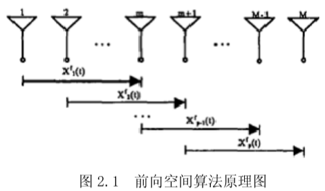

$~~~~~~$ 如图 2.1 所示，取第一个子阵（最左边的子阵）为参考子阵，那么各个子阵的输出矢量分别为：

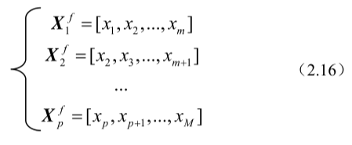

$~~~~~~$ 对于第 $k$ 个子阵有：

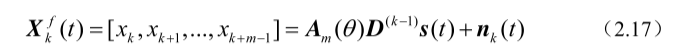

$~~~~~~$ 其中：

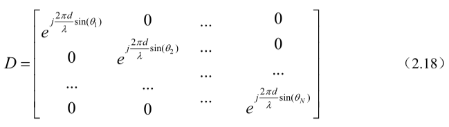

$~~~~~~$ 那么该子阵的数据协方差矩阵为：

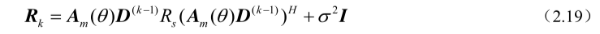

$~~~~~~$ 其中，$\pmb{A_m}$ 是一个 $m×p$ 的参考子阵（通常取第一个子阵）的导向矢量矩阵，

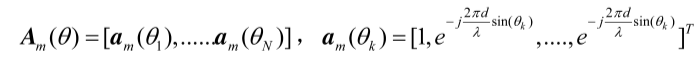
‘

$~~~~~~$ $\pmb{R_s}$ 为信号的协方差矩阵，$\pmb{R_s}=E\begin{Bmatrix}\pmb{SS}^H\end{Bmatrix}$ 。

$~~~~~~$ 前向空间平滑技术是通过求各个子阵协方差矩阵的均值来实现的，即取前向平滑修正的协方差矩阵为：

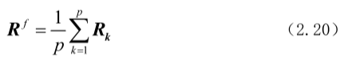

$~~~~~~$ 可以证明，当满足 $m<N,~p>N$ 时，前向空间平滑数据协方差矩阵 $\pmb{R}^f$ 是满秩的。即可以通过特征分解求得相应的信号子空间和噪声子空间。

## 前后向空间平滑

$~~~~~~$ 如果按照图 4 划分阵列，即称为后向空间平滑法，则各个子阵的输出矢量为

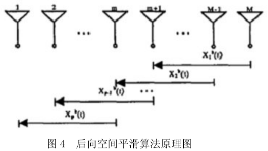

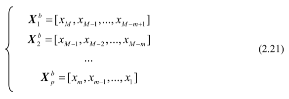

$~~~~~~$ 那么，第 $k$ 个子阵的数据矢量为：

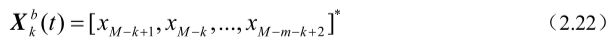

$~~~~~~$ 比较前向平滑和后向平滑的数据矢量，可以得到前向平滑中第 $k$ 个子阵与后向平滑中第 $p-k+1$ 个子阵之间存在如下关系：

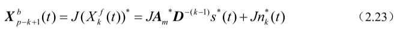

$~~~~~~$ 其中 $\pmb{J}$ 为 $m$ 的交换矩阵。$\pmb{J}=\begin{bmatrix}0&0&\cdots&1\\0&\cdots&1&0\\\cdots&\cdots&\cdots&\cdots\\1&0&\cdots&0\end{bmatrix}$  

$~~~~~~$ 所以后向平滑第 $p-k+1$ 个子阵的数据协方差为：

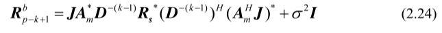

$~~~~~~$ 那么后向空间平滑修正的数据协方差矩阵为：

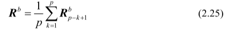

$~~~~~~$ 取前向平滑和后向平滑数据协方差矩阵的平均，即前后向空间平滑的数据矩阵，即

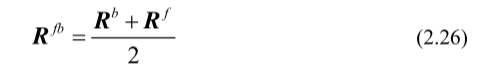

$~~~~~~$ 同样可以证明，当满足 $m<N,~p>N$ 时，后向空间平滑数据协方差矩阵 $\pmb{R}_b$ 是满秩的。