## 何谓空间谱估计

- 空间谱估计:利用空间阵列实现空间信号的参数估计的一项专门技术。   

- 空间谱估计系统组成：空间信号入射、空间阵列接收及参数估计。相应地可分为三个空间，即目标空间、观察空间及估计空间。

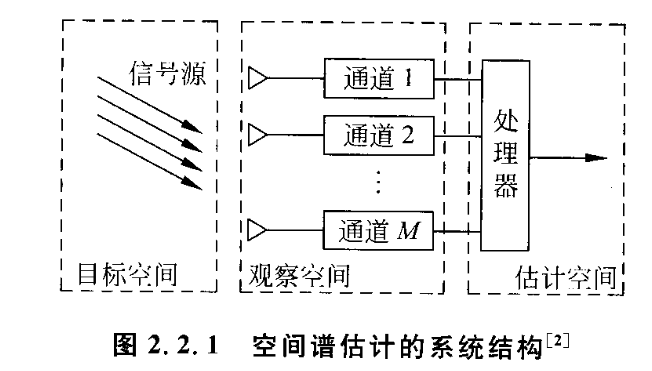

1) 目标空间是一个由信号源的参数与复杂环境参数张成的空间。对于空间谱估计系统，就是利用特定的一些方法从这个复杂的目标空间中估计出信号的未知参数。
2) 观察空间是利用空间按一定方式排列的阵元，来接收目标空间的辐射信号。由于环境的复杂性，所以接收数据中包含信号特征（方位、距离、极化等）和空间环境特征（噪声、杂波、干扰等）。另外由于空间阵元的影响，接收数据中同样也含有空间阵列的某些特征（互耦、通道不一致、频带不一致等）。这里的观察空间是一个多维空间，即系统的接收数据是由多个通道组成，而传统的时域处理方法通常只有一个通道。特别需要指出的是：通道与阵元并不是一一对应的，通道是由空间的一个、几个或所有阵元合成的（可以加权或不加权），当然空间某个特定的阵元可包含在不同的通道内。
3) 估计空间是利用空间谱估计技术（包含阵列信号处理中的一些技术，如阵列校正、空域滤波等技术）从复杂的观察数据中提取信号的特征参数。

## 通常情况下的数学模型

$~~~~~$ 首先，考虑 $N$ 个远场的窄带信号入射到空间某阵列，其中阵列天线由 $M$ 个阵元组成，这里假设阵元数等于通道数，即各阵元接收到信号后经各自的传输信道送到处理器，也就是说处理器接收来自 $M$ 个通道的数据。  
$~~~~~$ 在信号源是窄带的假设下，信号可用如下的复包络形式表示：

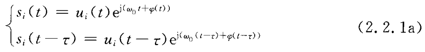

$~~~~~$ 式中，$u_i(t)$ 是接收信号的幅度，$φ(t)$ 是接收信号的相位，$\omega(0)$ 是接收信号的频率。在窄带远场信号源的假设下，有

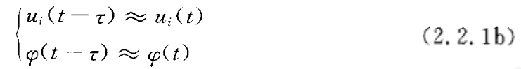

根据式（2.2.1a）和式（2.2.1b）,显然有下式成立：

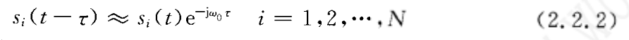

则可以得到第 $l$ 个阵元接收信号为

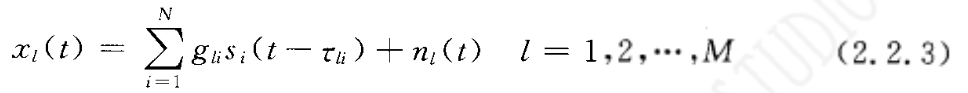

$~~~~~$ 式中，$g_{li}$ 为第 $l$ 个阵元对第 $i$ 个信号的增益，$n_l(t)$ 表示第 $l$ 个阵元在 $t$ 时刻的噪声，$\tau_{li}$ 表示第 $i$ 个信号到达第 $l$ 个阵元时相对于参考阵元的时延。  
$~~~~~$ 将 $M$ 个阵元在特定时刻接收的信号排列成一个列矢量，可得

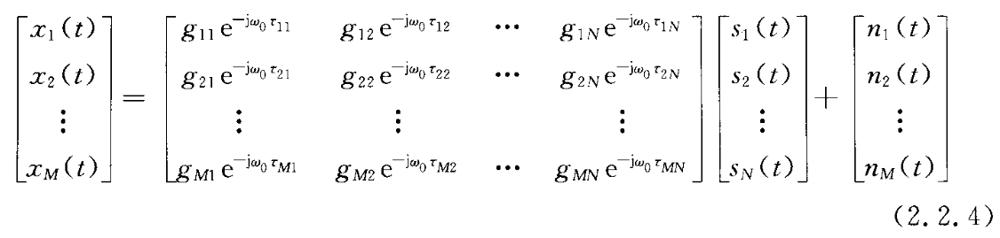

$~~~~~$ 在理想情况下，假设阵列中各阵元是各向同性的且不存在通道不一致、互耦等因素的影响，则式（2.2.4）中的增益可以省略（即归一化为1），在此假设下式（2.2.4）可以简化为

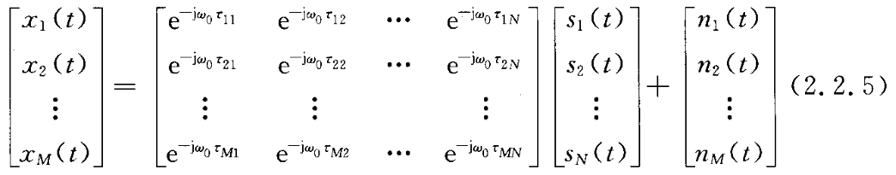

将式（2.2.5）写成矢量形式如下：

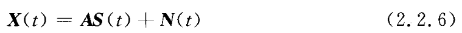

$~~~~~$ 式中，$X(t)$ 为阵列的 $M×1$ 维快拍数据矢量，$N(t)$ 为阵列的 $M×1$ 维噪声数据矢量，$S(t)$ 为空间信号的 $N×1$ 维矢量，$A$ 为空间阵列的 $M×N$ 维流型矩阵（导向矢量阵），且

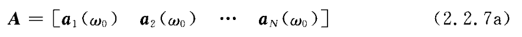

$~~~~~$ 其中，导向矢量为

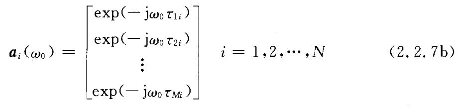

$~~~~~$ 式中，$\omega_0=2{\pi}f=2{\pi}\frac{c}{\lambda}$，$c$ 为光速，$\lambda$ 为波长。

$~~~~~$ 由上述的知识可知，一旦知道阵元间的延迟表达式 $\tau$ ，就很容易得出特定空间阵列的导向矢量或阵列流型。假设空间任意两个阵元，其中一个为参考阵元（位于原点），另一个阵元的坐标为 $(x,y,z)$ ，两阵列的几何关系如图2.2.2所示，图中“×”表示阵元。

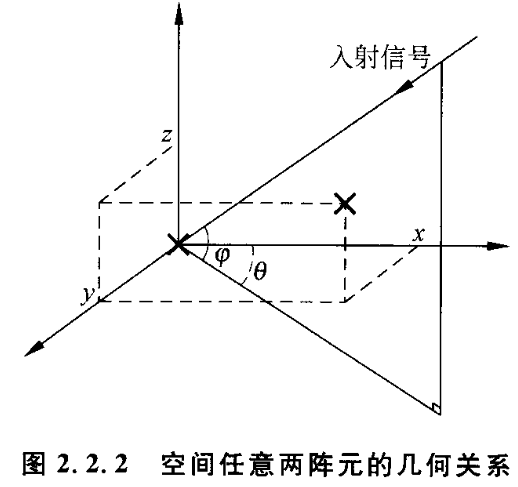

$~~~~~$ 由几何关系可以推导出两阵元间的波程差为

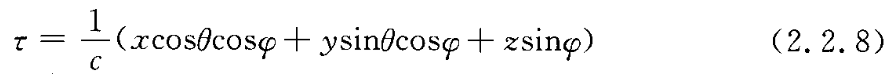

$~~~~~$ 其实就是位于 $x$ 轴上两阵元间的延迟、位于 $y$ 轴上两阵元间的延迟和位于 $z$ 轴上两阵元间的延迟之和。

$~~~~~$ 下面给出实际环境中常用的几种阵列及阵元间的相互延迟表达式。

**1. 平面阵**  
$~~~~~$ 设阵元的位置为 $(x_k,y_k)(k=1,2,\cdots,M)$ 以原点为参考点，另假设信号入射参数为 $(\theta_i,φ_i)(i=1,2,\cdots,N)$，分别表示方位角与俯仰角，其中方位角表示与 $x$ 轴的夹角，则有

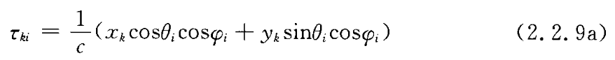

**2. 线阵**  
$~~~~~$ 设阵元的位置为 $x_k(k=1,2,\cdots,M)$ 以原点为参考点，另假设信号入射参数为 $\theta_i(i=1,2,\cdots,N)$，表示方位角，其中方位角表示与 $y$ 轴的夹角（即与线阵法线的夹角），则有

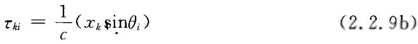

**3. 均匀圆阵**  
$~~~~~$ 设以均匀圆阵的圆心为参考点，则有

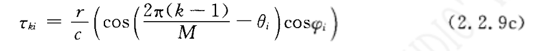

$~~~~~$ 其中，方位角表示与 $x$ 轴的夹角，$r$ 为圆半径。

## 相干信号源的数学模型

$~~~~~$ 在实际环境中相干信号源是普遍存在的，如信号传输过程中的多径现象，或者敌方有意设置的电磁干扰等。相干信号源的检测与估计是空间谱估计中一个重要的研究方向，因此这里研究一下相干信号源的数学模型。当考察多个信号时，这些信号之间可以是不相关的、相关的或相干的。对两个平稳信号 $s_i(t)$ 和 $s_k(t)$ ，定义它们的相关系数为

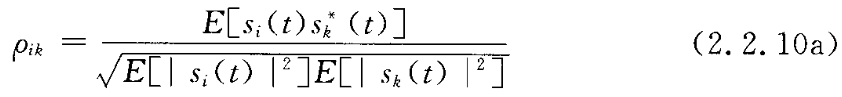

由 Schwartz 不等式可知 $|\rho_{ik}{\le}1|$ ，因此，信号之间的相关性定义如下：

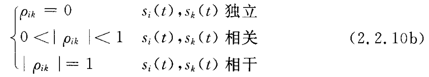

$~~~~~$ 由上面的定义可知，当信号源相干时其数学表现为：相干信号源间只差一个复常数，假设有 $n$ 个相干源，即

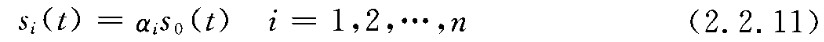

$~~~~~$ 这里，$s_0(t)$ 可以称为生成信源，因为它生成了入射到阵列上的 $n$ 个相干信号源。将式（2.2.11）代入式（2.2.6）可得相干信号源模型

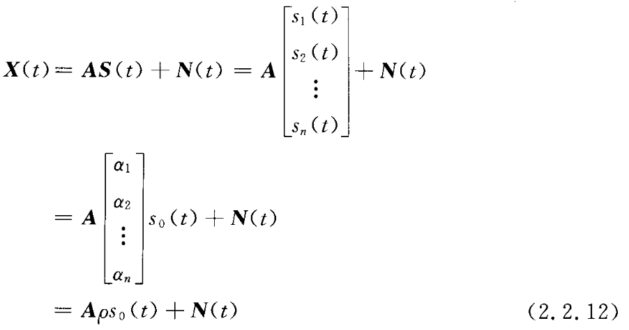

$~~~~~$ 式中，$\rho$ 是由一系列复常数组成的 $n×1$ 维矢量。