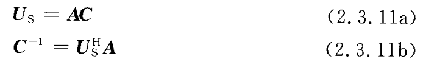

- 具有 $n$ 个元素的白噪声向量 $w$ 的协方差矩阵 $R$ 必须是 $n×n$ 对角矩阵，其中每个对角元素 $R_{ii}$ 是分量 $\omega_i$ 的方差；相关矩阵必须是 $n×n$ 的单位矩阵。

- 相关矩阵也叫相关系数矩阵，其是由矩阵各列间的相关系数构成的。也就是说，相关矩阵第 $i$ 行第 $j$ 列的元素是原矩阵第 $i$ 列和第 $j$ 列的相关系数。

- 实对称矩阵的不同特征值的特征向量正交。

***

## 理想情况下数学模型的二阶统计特性

假设（或者说前提）：  
1. 信号源数小于阵元的数目，以确保阵列流型矩阵的各列线性独立；
2. 噪声序列为一零均值高斯过程，各阵元间噪声相互独立，噪声与信号也相互独立；
3. 信号源通常为窄带远场信号；
4. 组成阵列的各传感器为各向同性阵元，且无互耦以及通道不一致的干扰。

$~~~~~$ 对于式（2.2.6）即 $X(t)=AS(t)+N(t)$ 的数学模型，根据上述几点假设，考察到阵列快拍数据的协方差矩阵

$~~~~~$ 式中，$R_s,R_N$ 分别为信号协方差矩阵和噪声协方差矩阵，对于空间理想的白噪声且噪声功率为 $\sigma^2$ ，则有下式成立：

$~~~~~$ 对 $R$ 进行特征分解有

$~~~~~$ 式中，$U$ 为特征矢量矩阵，其中由特征值组成的对角阵 $\sum$ 如下：

$~~~~~$ 上式中的特征值满足如下关系：

$~~~~~$ 定义如下两个对角矩阵：

显然当空间噪声为白噪声时，有

$~~~~~$ 式中，$\sum_s$ 为大特征值组成的对角阵，$\sum_N$ 为小特征值组成的对角阵。再将特征矢量矩阵分为与特征值对应的两部分：一是与大特征值对应的信号子空间 $U_S=[e_1~~~e_2~~~\cdots~~~e_N]$ ，二是 $U_N[e_{N+1}~~~e_{N+2}~~~\cdots~~~e_M]$ ，即与小特征值对应的噪声子空间。这样，式（2.3.3a） 可以进一步写成如下形式：

## 一些在信号源独立的条件下关于特征子空间的一些性质

**性质 2.3.1**    协方差矩阵的大特征值对应的特征矢量张成的空间与入射信号的导向矢量张成的空间是同一个空间，即

**性质 2.3.2**    信号子空间 $\pmb{U_S}$ 与噪声子空间 $\pmb{U_N}$ 正交，且有 $\pmb{A^H e_i}=0$ ，其中 $i=N+1,\cdots,M$ 。

**性质 2.3.3**    信号子空间 $\pmb{U_S}$ 与噪声子空间 $\pmb{U_N}$ 满足

$$
\pmb{U_S U_S^H} + \pmb{U_N U_N^H} = \pmb{I} \\
\pmb{U_S^H U_S} = \pmb{I} \\
\pmb{U_N^H U_N} = \pmb{I}
$$

**性质 2.3.4**    信号子空间 $U_S$、噪声子空间 $U_N$ 及阵列流型 $A$ 满足

**性质 2.3.5**    定义 $\sum^{'}=\sum_S-\sigma^2\pmb{I}$ ，则有下式成立：

**性质 2.3.6**    定义 $C=R_S A^H U_S \sum^{'-1}$ ，则有下式成立：

**性质 2.3.7**    定义 $Z=U_S \sum^{'-1} U_S^H A$ ，则有下式成立：

**性质 2.3.8**    信号协方差矩阵 $R_S$ 满足

**性质 2.3.9**    定义 $W=\sum^{'2}\sum_S^{-1}$ ，则有下式成立：

**性质 2.3.10**    定义 $T=U_SW_SU_S^H$ ，$W_S=diag{\frac{\lambda_i}{(\lambda_i-\sigma^2)^2}}$ ，则有下式成立：

 

- 需要说明的是，在具体实现中，数据协方差矩阵使用采样协方差矩阵 $\pmb{\hat{R}}$ 代替的，即

$~~~~~$ 式中，$L$ 表示数据的快拍数，对 $\pmb{\hat{R}}$ 进行特征分解可以计算得到噪声子空间 $\pmb{\hat{U}_N}$ 、信号子空间 $\pmb{\hat{U}_S}$ 及由特征值组成的对角矩阵 $\pmb{\widehat{\sum}}$ 。