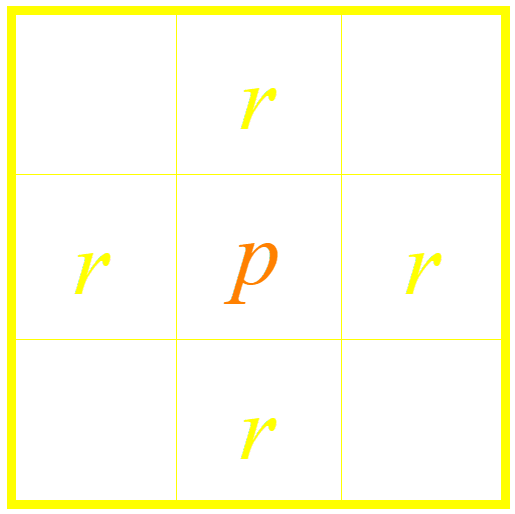
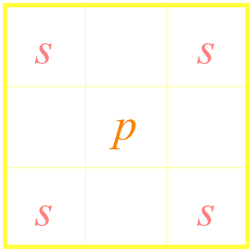
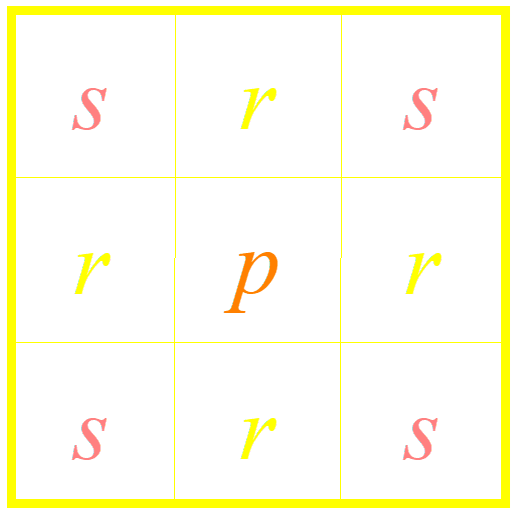
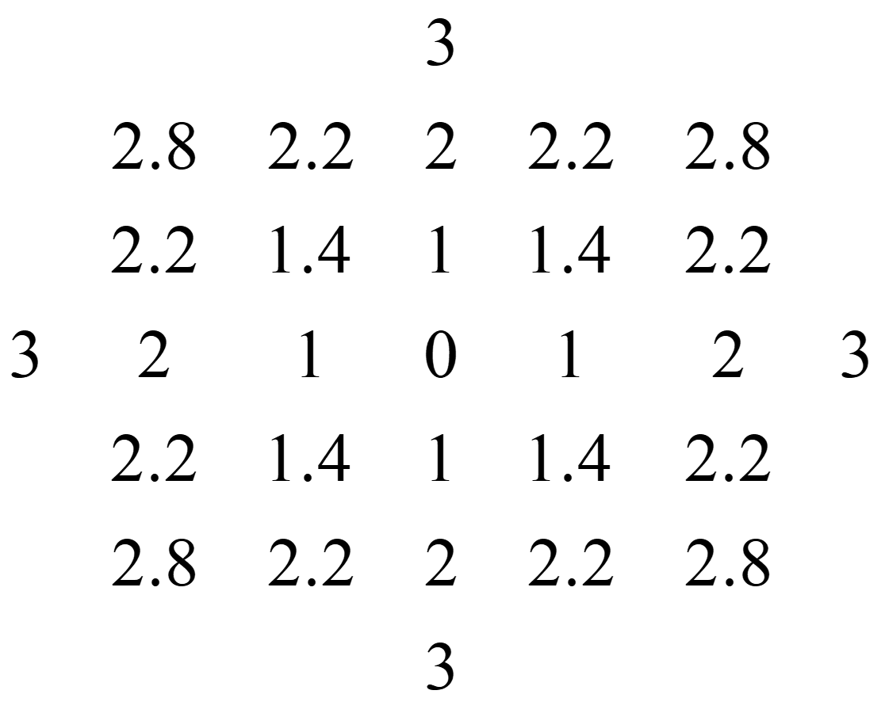
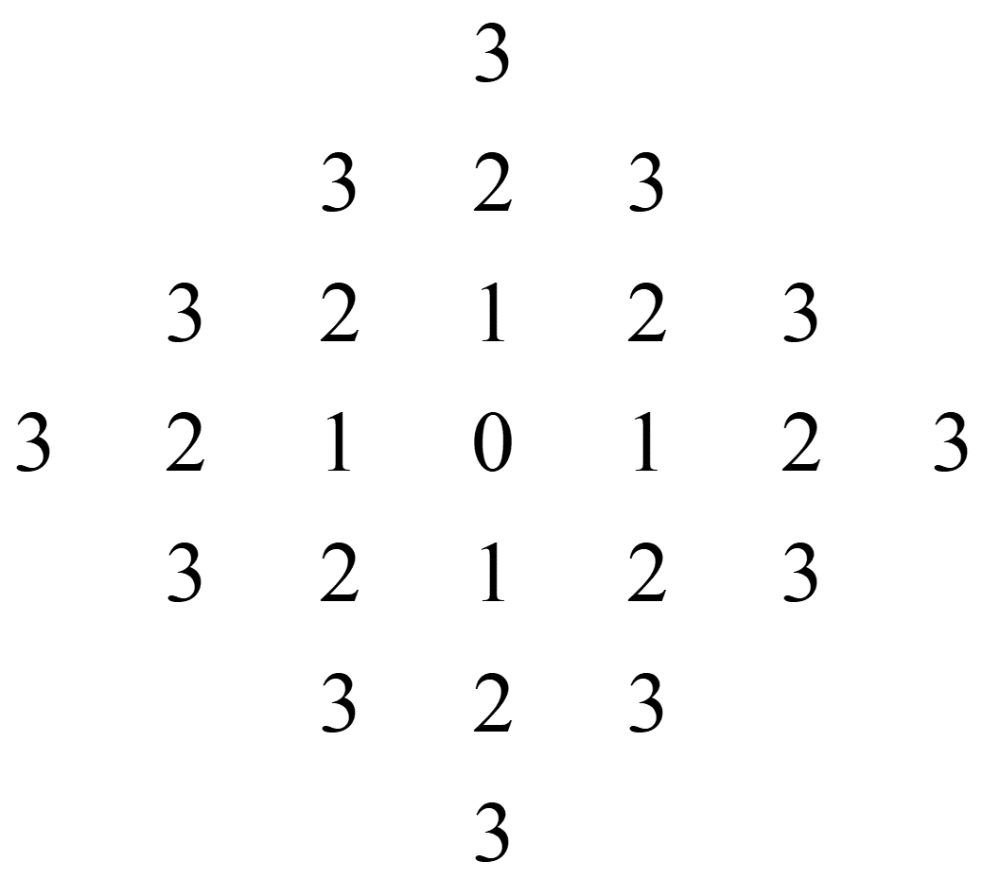
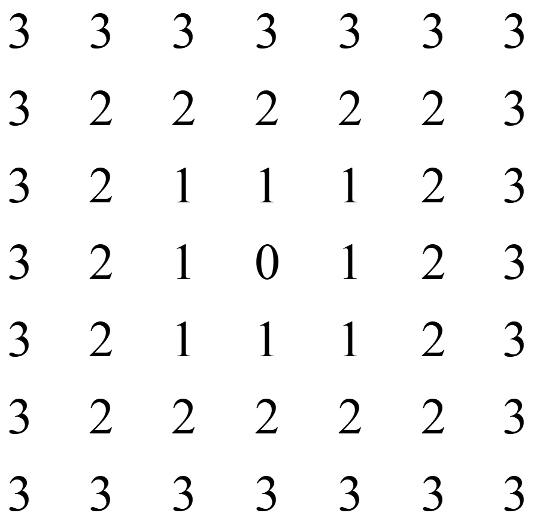

## 像素间的联系

### 像素的邻域

- **4-邻域 $N_4(p)$**  
由4个标记为 `r` 的像素所构成的集合

  

- **对角邻域 $N_D(p)$**  
由4个标记为 `s` 的像素所构成的集合

  

- **8-邻域 $N_8(p)$**  
由8个标记为 `r 、s` 的像素所构成的集合

 

### 像素间的邻接、连接和连通

#### 像素的邻接 VS 连接

- 两个像素是否邻接 
    - 邻接仅考虑像素间的空间关系，即两个像素在空间上若相互接触，则它们为邻接的

- 两个像素是否连接 
    - 在空间上是否邻接
    - 它们的灰度值是否满足某个特定的相似准则（例如，同在一个灰度值集合中取值）

#### 像素间的4-连接、8-连接

设用 **`V`** 表示定义连接的灰度值集合

- **4-连接**  
2个像素 `p` 和 `r` 在 `V` 中取值，且 `r` 在 $N_4(p)$ 中

- **8-连接**  
2个像素 `p` 和 `r` 在 `V` 中取值，且 `r` 在 $N_8(p)$ 中。

#### 像素的连通

若两个像素具有相同性质，且能够找到两两连接的一条通路，则称它们是连通的。
- 通路由一系列依次连接的像素组成
    - 从具有坐标 $(x, y)$ 的像素 $p$ 到具有坐标 $( s, t)$ 的像素 $q$ 的一条通路由一系列具有坐标 $(x_0, y_0)，(x_1, y_1)，…，(x_n, y_n)$ 的独立像素组成
    - 这里 $(x_0, y_0) = (x, y)，(x_n, y_n) = (s, t)$，且 $(x_i, y_i)$ 与 $(x_i-1, y_i-1)$ 连接，其中 $1 ≤ i ≤ n$，$n$ 为通路长度（即像素个数减1）
- 连接是连通的一种特例

#### 像素集合（图像子集）的邻接和连通

- 像素集合的邻接  
对两个图像子集 $S$ 和 $T$ 来说，如果 $S$ 中的一个或一些像素与 $T$ 中的一个或一些像素邻接，则称 $S$ 和 $T$ 邻接。

- 像素集合的连通
    - 是否是邻接图像子集；
    - 图像子集中的邻接像素的灰度值是否满足某个特定的相似准则。

### 像素间的距离

设3个像素p、q、r，坐标为(x, y)、(s, t)、(u, v)，则其像素间的距离具有如下特性：
- 两个像素之间的距离总是正的（非负性）

$$  
D(p,q)\ge0~~(D(p,q)=0~~当且仅当~~p=q)
$$

- 距离与起止点的选择无关（对称性）

$$
D(p,q) = D(q,p)
$$

- 最短距离是沿直线的（两边之和大于等于第三边）

$$
D(p,r)\le D(p,q)+D(q,r)
$$

#### 像素间距离的度量函数

设2个像素p、q，坐标为(x, y)、(s, t)

1. 欧氏（Euclidean）距离 $D_E(p,q)$

$$
D_E(p,q) = [(x-s)^2+(y-t)^2]^{1/2}
$$

- 与坐标为 $(x , y)$ 的像素的 $D_E$ 距离小于或等于某个值 $d$ 的像素都包括在以$(x , y)$为中心、以 $d$ 为半径的圆中

 

2. 城区（city-block）距离 $D_4(p,q)$

$$
D_4(p,q)=|x-s|+|y-t|
$$

- 与坐标为 $(x , y)$ 的像素的 $D_4$ 距离小于或等于某个值 $d$ 的像素组成以 $(x , y)$ 为中心的菱形

 

- 用城区距离定义4-邻域 $N_4(p):N_4(p)=\{r|D_4(p,r)=1\}$

3. 棋盘（chessboard）距离 $D_8(p,q)$

$$
D_8(p,q)=max(|x-s|,|y-t|)
$$

- 与坐标为 $(x , y)$ 的像素的 $D_8$ 距离小于或等于某个值 $d$ 的像素组成以 $(x , y)$ 为中心的正方形

 

- 用棋盘距离定义8-邻域 $N_8(p):N_8(p)=\{r|D_8(p,r)=1\}$
