## 图像缩放的公式

### 图像缩放的变换公式

图像缩放是图像的一种形状变换，指图像中的像素点相对于坐标原点沿 $X$ 方向和 $Y$ 方向，分别按照比例系数 $C_x$ 和 $C_y$ 进行尺度的变换，其变换公式如下：

- 直角坐标公式：$x={c_x}{x_0},~~y={c_y}{y_0}$
    - $(x_0,y_0)、(x,y)$分别为缩放前后的坐标
    - 比例系数 > 1：放大
    - 比例系数 < 1：缩小

- 齐次坐标公式

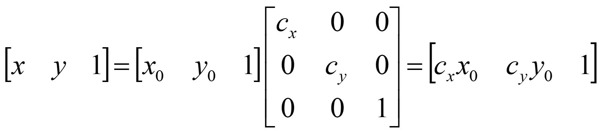
 

## 图像的缩小

- 按比例缩小：水平、垂直方向的缩小比例相同  
- 不按比例缩小：水平、垂直方向的缩小比例不同

### 图像缩小的实现方法

- 图像缩小实际上就是对原有的多个样本（像素）进行挑选或处理，从而获得期望的缩小尺寸的样本（像素），并且尽量保持原有的特征不丢失
- 最简单的方法就是等间隔地选取样本（重采样）

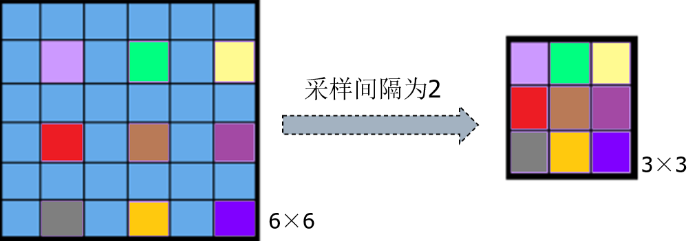
 

#### 算法步骤

1. 确定重采样的行和列，即计算采样间隔（等于缩小系数的倒数）
    - $M×N$ 的图像缩小为：${c_xM} × {c_yN}$，其中 $c_x、c_y \lt 1$
    - 采样间隔为：$k_x=1/c_x ，k_y=1/c_y$ 
2. 对原图像进行重采样，得到缩小后的新图像
    - 确定结果图像各像素的坐标，即 $0 \le x \le c_xM-1，0 \le y \le c_yN-1$
    - 将结果图像各像素的坐标映射到原图像空间中，获得结果图像各像素的像素值，即  

$G(x, y) = F(int(k_x×x), int(k_y×y))$

其中，$G$ 为缩小后的结果图像，$F$ 为原图像

### 算法示例

 

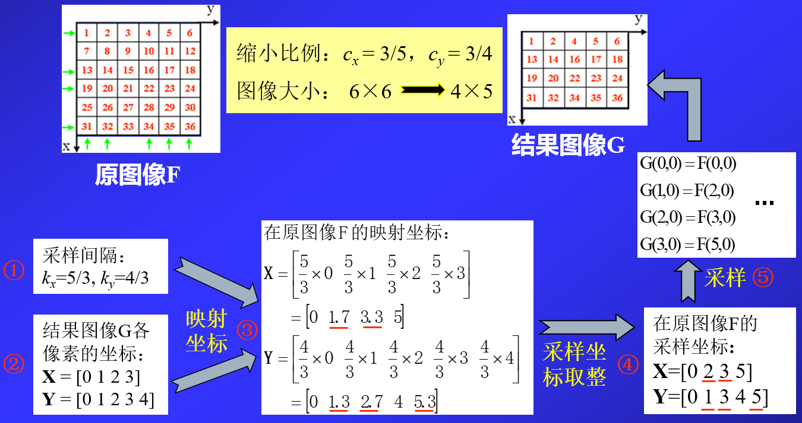

## 图像的放大

- 图像放大从字面上看，是图像缩小的逆操作。但是从信息处理的角度来看，则难易程度完全不一样
    - 图像缩小是从多个信息中选出所需要的信息
    - 图像放大则是需要对多出的空位填入适当的值，是信息的估计，较图像缩小更难
- 按比例放大：水平、垂直方向的放大比例相同
- 不按比例放大：水平、垂直方向的放大比例不同

### 图像放大的实现方法

如果需要将原图像放大 $k$ 倍，则将原图像中的每个像素值，填在新图像中对应的 $k×k$ 大小的子块中。

#### 算法步骤

1. 计算放大后图像的大小
    - $M×N$ 的图像放大为：$c_x M×c_y N$，其中 $c_x、c_y > 1$

2. 求出放大的新图像像素值
    - 将结果图像各像素的空间坐标映射到原图像空间中
    - 计算结果图像各像素点的像素值 $G(x,y)=F(x/c_x , y/c_y)$ 。	其中，$G$ 为放大后的结果图像，$F$ 为放大前的原图像，且 $0 \le x \le c_xM-1、0 \le y \le c_yN-1$

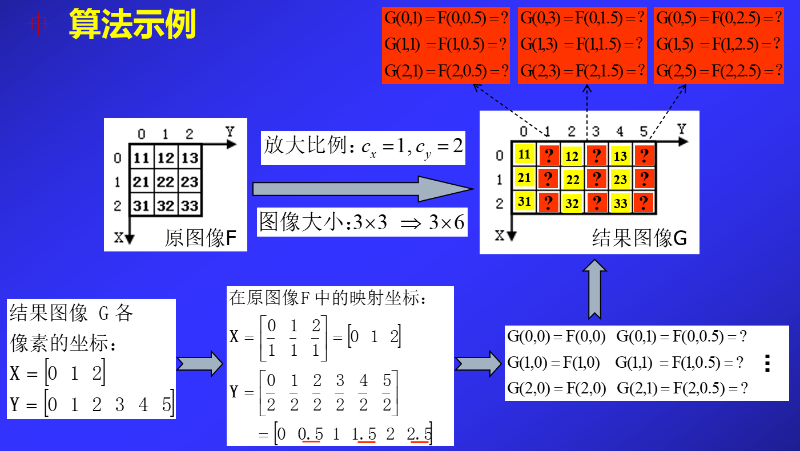

3. 当映射坐标 $(x/c_x , y/c_y)$ 在原图像空间中不存在时，采用插值方法计算小数坐标处的像素值

### 常用插值方法

- 常用的插值方法：最近邻插值、双线性插值、双三次插值
    - 最近邻插值：算法简单，速度最快，插值结果不连续，视觉上锯齿效应明显
    - 双线性插值：插值结果相对连续，视觉上比最近邻插值要平滑
    - 双三次插值：在保持细节方面比双线性插值相对要好，是商业图像编辑程序的标准插值方法

#### 最近邻插值

- **算法原理**  
将放大后未知的像素点坐标换算到原始图像上，并与原始图像上邻近的4个像素点做比较，最靠近的邻近点的像素值即为该未知像素点的像素值。

- **算法的实现步骤**
1. 将放大的结果图像 $G$ 的像素点 $(u,v)$ 的坐标换算到原始图像上对应像素点的坐标 $(x+Δx,y+Δy)$
2. 在原始图像上分别计算像素点 $(x+Δx,y+Δy)$ 与 4 个邻近像素点 $(x,y)$、$(x,y+1)$、$(x+1,y)$、$(x+1,y+1)$ 之间的距离（如欧氏距离），取距离最短的点的像素值作为像素点 $(x+Δx、y+Δy)$ 的像素值，也即放大后的像素点 $(u,v)$ 的像素值

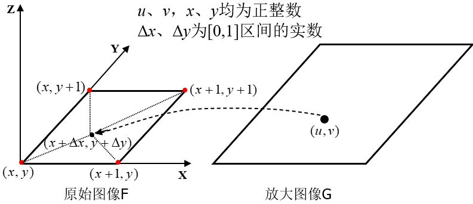

#### 双线性插值

- **算法原理**  
    - 首先，假设像素的灰度级在水平、垂直方向上都是线性变化的。  
    - 其次，为了求解未知像素点 $P$ 的灰度值，需要将其坐标换算到原始图像上，并计算原始图像上的 4 个邻近像素点 $A、B、C、D$ 对 $P$ 点的影响，即 $P$ 点的灰度值由 4 个邻近点 $A、B、C、D$  的灰度级加权求和得到（权值可以采用距离进行度量，距离越近，权值越大）。

- **算法的实现步骤**
1. 将结果图像 $G$ 的未知像素点 $P$ 的坐标 $(u,v)$ 换算到原始图像 $F$ 上对应像素点的坐标 $(x+Δx,y+Δy)$，并确定其在 $F$ 上的 4 个邻近点 $A、B、C、D$ 的坐标，分别为 $(x,y)$、 $(x,y+1)$ 、$(x+1,y)$、 $(x+1,y+1)$

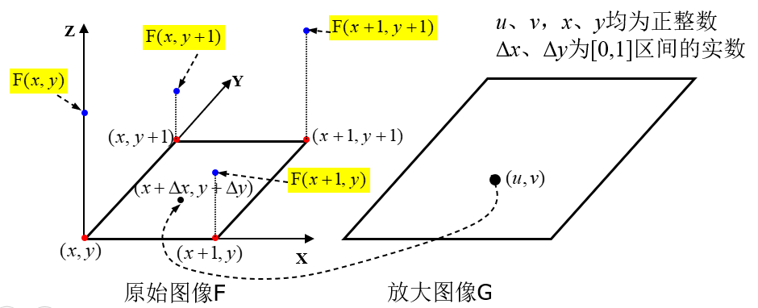

2. 由 $A、B$ 两点插值计算出坐标为 $(x,y+Δy)$ 的 $e$ 像素点的灰度值 $F(x,y+Δy)$

$$
F(x,y+Δy)=\frac{\sqrt{(x-x)^2+((y+1)-(y+Δy))^2}}{\sqrt{(x-x)^2+((y+1)-y)^2}}F(x,y) + \frac{\sqrt{(x-x)^2+((y+Δy)-y)^2}}{\sqrt{(x-x)^2+((y+1)-y)^2}}F(x,y+1)
$$

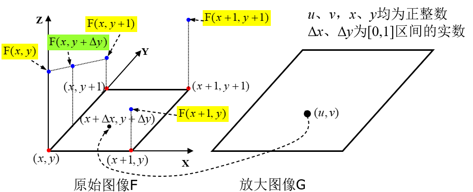

3. 由 $C、D$ 两点插值计算出坐标为 $(x+1,y+Δy)$ 的 $f$ 像素点的灰度值 $F(x+1,y+Δy)$

$$
F(x+1,y+Δy)=\frac{\sqrt{((x+1)-(x+1))^2+((y+1)-(y+Δy))^2}}{\sqrt{((x+1)-(x+1))^2+((y+1)-y)^2}}F(x+1,y) + \frac{\sqrt{((x+1)-(x+1))^2+((y+Δy)-y)^2}}{\sqrt{((x+1)-(x+1))^2+((y+1)-y)^2}}F(x+1,y+1)
\\
$$

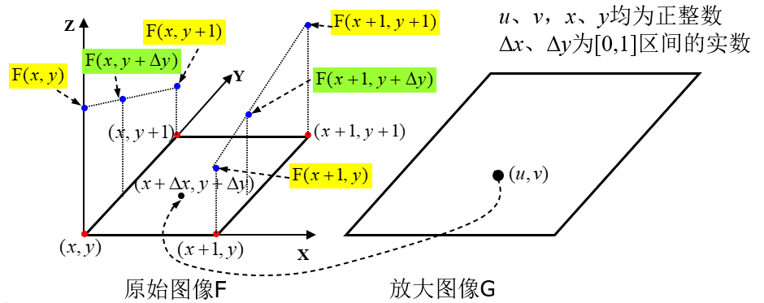

4. 由 $e、f$ 两点插值计算出坐标为 $(x+Δx,y+Δy)$ 的 $P$ 像素点的灰度值 $F(x+Δx,y+Δy)$

$$
F(x+1,y+Δy)= \frac{\sqrt{((x+1)-(x+Δx))^2+((y+Δy)-(y+Δy))^2}}{\sqrt{((x+1)-x)^2+((y+Δy)-(y+Δy))^2}}F(x,y+Δy) \\
 + \frac{\sqrt{((x+Δx)-x)^2+((y+Δy)-(y+Δy))^2}}{\sqrt{((x+1)-x)^2+((y+Δy)-(y+Δy))^2}}F(x+1,y+Δy)
\\
$$

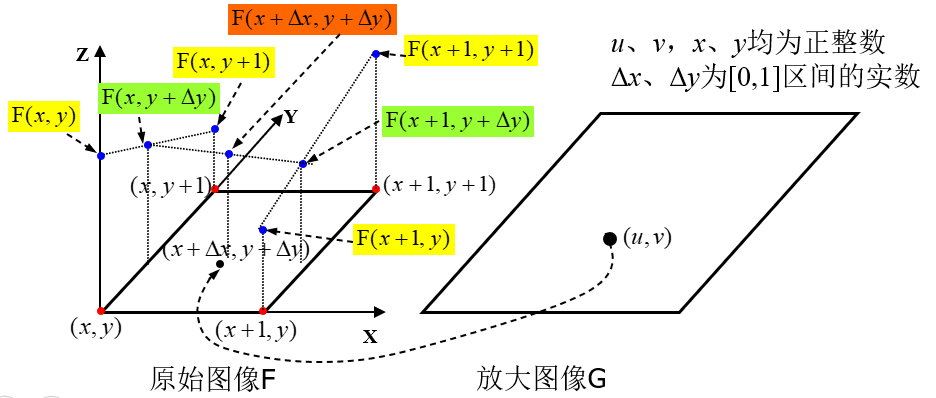

 

- **算法示例**

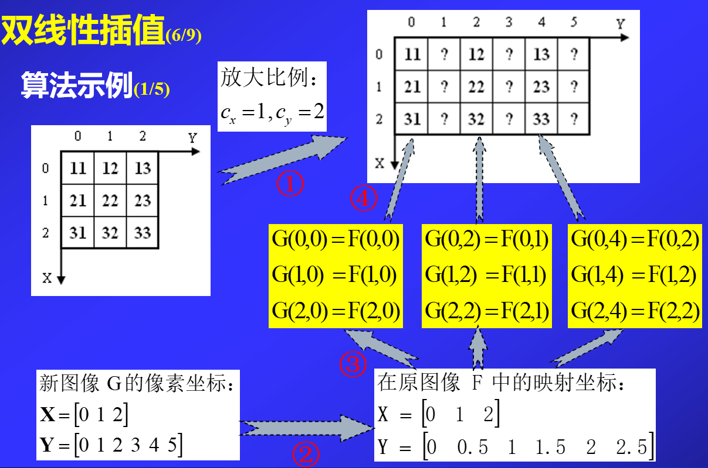

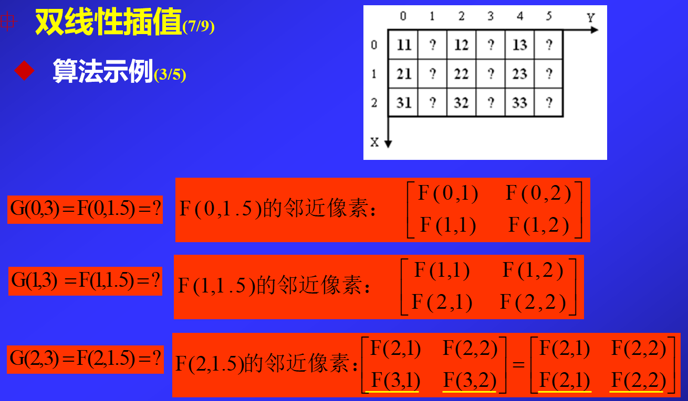

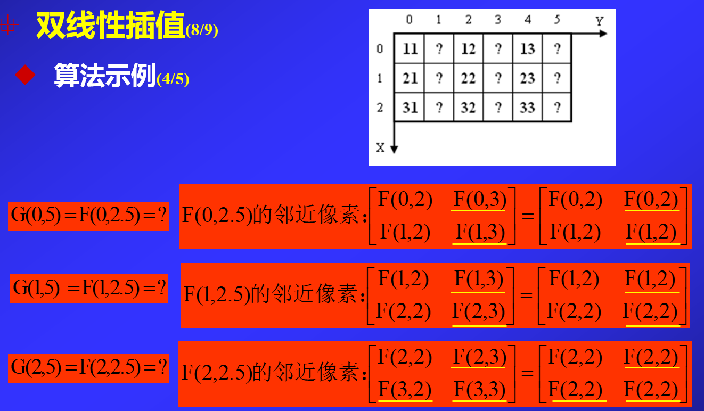

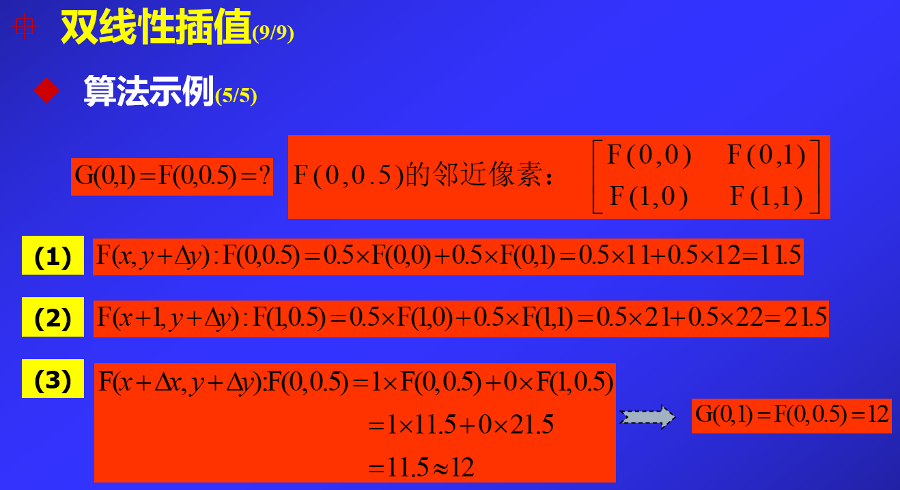

#### 双三次插值

- **算法原理**
    - 首先，将未知像素点 $P$ 的坐标 $(u,v)$ 换算到原始图像空间的 $(x,y)$ 处
    - 其次，确定原始图像上的 16 个邻近像素点
    - 最后，采用如下的三次多项式计算未知像素点P的灰度值 $F(x,y)$:

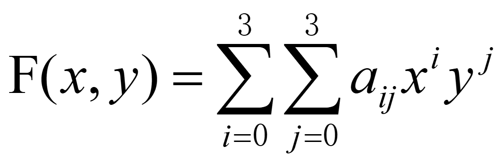

其中，16 个未知系数 $a_{ij}$ 可由原始图像 $(x,y)$ 处的 16 个邻近像素所确定的方程组进行求解

- **算法实现步骤**
    - 首先，进行坐标映射，确定原图像中的 16 个邻近点
    - 其次，在 4 条水平直线上分别用三次多项式插值计算点 $A$、$B$、$C$、$D$ 处的灰度值
    - 最后，对 $A$、$B$、$C$、$D$ 四点在垂直方向上再做三次多项式内插
 

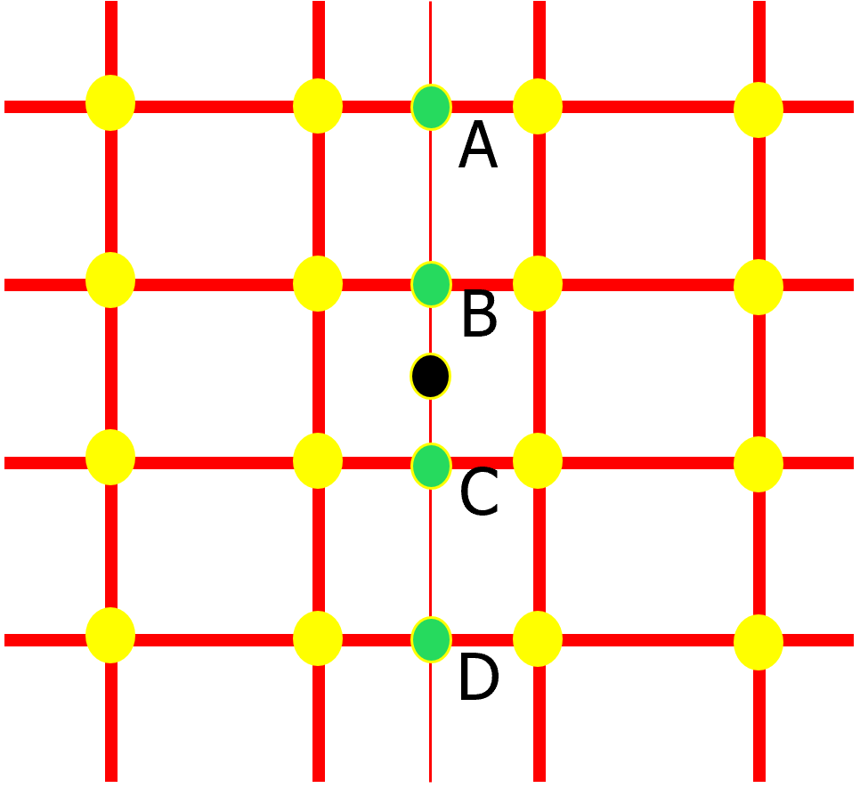

