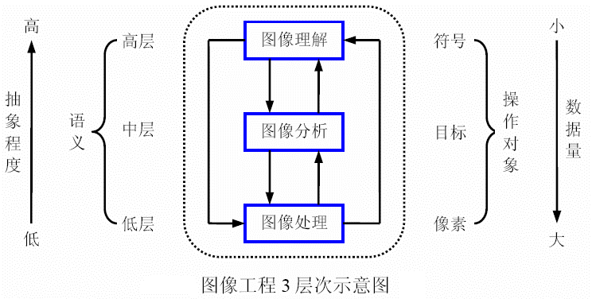

## 基础概述

### 数字图像处理编程语言

- 数字图像处理一般使用三种语言：`Matlab`、`C++(OpenCV)`、`python`。

### 图像增强和图像恢复

- **图像增强**，目的是突出图像中感兴趣的部分，而减弱或去除不需要的信息，从而使有用信息得到加强。
- **图像恢复**，目的是去除干扰和模糊，恢复图像本来的面目，如去噪。

### 计算机视觉

- 计算机视觉，主要指用摄像头和电脑代替人眼对目标进行识别、跟踪和测量等机器视觉，并进一步做数字图像处理，用电脑处理成为更合适人眼观察或传送给仪器检测的图像。
- 计算机视觉和图像处理领域三大国际会议：**`CVPR、ICCV、ECCV`**。

### 灰度图像和二值图像

- **灰度图像**，当一幅图像具有灰度级时，常称该图像是**k比特图像**。比如，一幅有$2^8=256$个灰度级，就称其为8比特图像。一般地，“0”级表示纯黑色，“255”级表示纯白色，中间的灰度级从小到大表示由黑到白的过渡。  
- **二值图像**，“0”表示白色，“1”表示黑色。

### 彩色图像表示模型

- **RGB模型**分别用**红(R)、绿(G)、蓝(B)**三原色的组合来表示每个像素的颜色。通常，三元组的每个数值是在0到255之间，0表示相应的基色在该像素中没有，而255则代表相应的基色在该像素中取得最大值。  
- **HSI模型**中，**H表示色度(hue)，S表示饱和度(saturation)，I表示强度(intensity)，即亮度**。其中色度和饱和度表示颜色的彩色信息，而I决定了像素的整体亮度，与彩色信息无关。  

### 归一化

- 在进行图像处理的时候经常要对图像进行**归一化**，这是为了**避免发生精度丢失**。正常图像存储时都是以整数值存储的，比如一个灰度值为3的像素，进行除法时会变成小数0.33，但计算机会识别为0，这就发生了精度丢失。

### **空间分辨率**和**灰度级分辨率**

- 空间分辨率
    - 空间分辨率是指图像中可辨别的最小细节
    - 空间分辨率是由采样过程（采样间隔）决定的
- 灰度级分辨率
    - 灰度级分辨率是指在灰度级别中可分辨的最小变化
    - 灰度级分辨率是由量化过程决定的  
- 例如，通常把大小为`M X N`、灰度为 `L` 级的数字图像称为空间分辨率为`M X N` ，灰度级分辨率为 `L` 级的数字图像

### 与图像质量相关的其他指标

- 对比度
    - 对比度是指一幅图像中灰度反差的大小
    - 对比度 = 最大亮度 / 最小亮度 

### 图像工程三个层次

#### 图像处理

- 利用计算机来改进图像的品质
- 输入输出都是图像

#### 图像分析

- 主要是对图像中感兴趣的目标进行检测（分割）和测量（特征提取），提取出对它进行描述的信息
- 输入是图像，输出可以是对图像描述的特征数据（如：长度、面积等），或用符号表示的特征（如：用a表示`—`，用b表示`|`）

#### 图像理解

- 在图像分析的基础上，找出各目标的性质以及它们之间的相互联系，最终得到对图像内容和含义的理解，以及对客观场景的解释
- 输入是图像，输出是对图像解释

#### 图像工程三个层次关系

  

