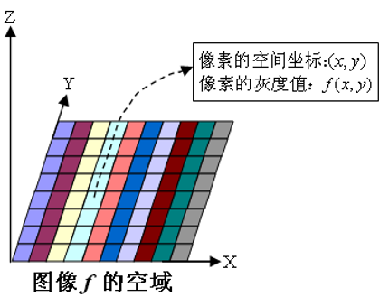
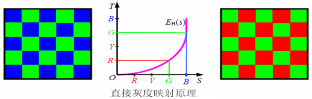
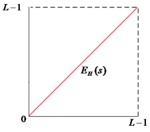
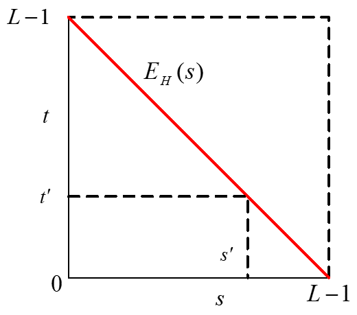
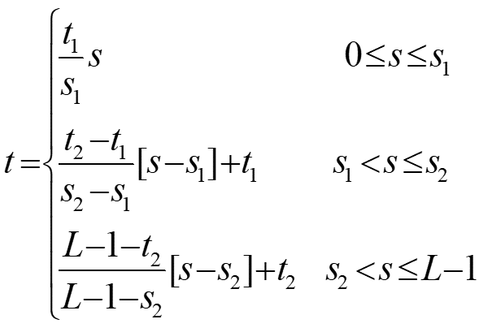
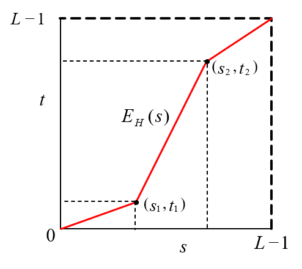
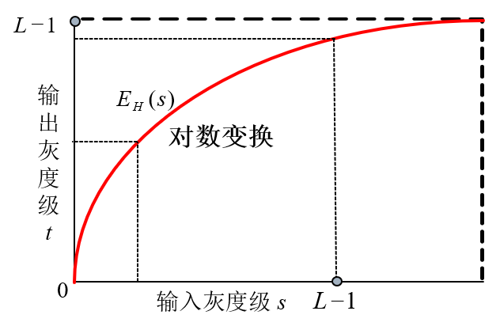

## 空域增强技术的概述

### 空域的概念

- 在图像处理中，空域是指由像素组成的空间
- 图像的空域增强技术是指直接作用于图像像素的增强技术

 

### 空域增强的模型  

- **$g(x,y) = E_H[f(x,y)]$** 
    - 其中，$f(x,y)$ 为原始图像，$g(x,y)$ 为增强后的图像，$E_H$ 为增强操作

- **目的** 
    - 改善图像的质量（视觉效果），或将图像转换成更适合于人和机器进行处理分析的形式

### 空域增强技术的分类

#### 1.基于像素的空域增强

**$E_H$ 仅定义在每个像素$(x,y)$上**

- **像素点操作：$g(x,y) = P_{xy}[f(x,y)]$**
    - 改变当前像素的灰度
    - 输入为当前像素的灰度，或者当前像素的位置

- **几何操作：$(x’,y’) = M(x,y)$**
    - 改变当前像素的位置
    - 输入为当前像素的原始位置，$M$ 为几何映射函数 

#### 2.基于模板的空域增强

**$E_H$ 定义在像素$(x,y)$的某个邻域上:** $~~~t=E_H[s,n(s)]$
- $s、t$ 分别为原始图像 $f$ 和结果图像 $g$ 在处 $(x,y)$ 的灰度值
- $n(s)$为图像 $f$ 在以 $(x,y)$ 为中心的邻域内像素的灰度值集合

## 图像间的运算

### 算术运算

- 对图像进行的算术运算是逐像素进行的，即两幅图像的对应(位置)像素间进行算术运算
- 设两幅图像对应位置的像素为 $p、q$，则其算术运算表示如下：
    - 加法：$p + q$
    - 减法：$p - q$
    - 乘法：$p * q、p × q、pq$
    - 除法：$p ÷ q$

### 图像间算术运算的应用

(1) 图像间加法的运用  
- 去除图像噪声，可用于图像平均以减少或去除图像中的加性噪声   
原始图像：$f(x,y)$，随机噪声：$e(x,y)$  
噪声污染图像：$g(x,y)=f(x,y)+e(x,y)$  
$M$幅噪声污染图像相加求平均：$\overline{g}(x,y)=\frac{1}{M} \sum_{i=1}^{M}g_i(x,y)$  
当$M$增大，即对图像相加次数增加时，去除加性噪声的效果更加明显

- 生成图像叠加效果

(2) 图像间减法的运用  
- 数字减影、森林火灾、运动跟踪和检测、污染检测、伪印章鉴别

(3) 图像间乘法的运用  
- 用二值模板图像与原图像做乘法进行图像的局部显示

## 直接灰度映射

### 灰度映射原理

按照某种映射规则或变换函数，将图像中的每个像素点的灰度值转化成另一灰度值。

 

设原灰度值 $s$ 和映射后灰度值 $t$ 的取值范围都为 $0$ 到 $L-1$。如果变换曲线是从原点到 $(L-1，L-1)$ 的直线，则变换前后灰度值不变。

### 典型灰度映射——图像求反

**作用**：将原图 **灰度值翻转**，黑变白、白变黑  
假设原始图像任意像素点的灰度值为 $s$ ，经过灰度映射后的灰度值为 $t$ ，且灰度映射前后的灰度值取值范围为 $[0 , L-1]$，则图像求反的模型为：$t=(L-1)-s$

### 典型灰度映射——分段线性增强

- 基于像素的图像增强，也即图像的对比度增强，就是增强原图的各部分反差（增强感兴趣的灰度区域，相对抑制不感兴趣的灰度区域）。
- **分段线性增强** 用于拉伸感兴趣的图像细节的灰度级，同时压缩不感兴趣的图像细节的灰度级，即增强图像细节之间的对比度。
- 分段线性增强的典型变换函数是三段线性变换函数：

$~~~~~~~~~~$

- 线性变换的斜率不同，所起的作用不一样
    - 斜率大于1，则提高对比度
    - 斜率小于1，则降低对比度

### 典型灰度映射——对数变换

- **适用场景**  
    - 扩展图像中的暗像素的值，同时压缩高灰度级的值
    - 原图动态范围太大，超出某些显示设备的允许动态范围，需要压缩其动态范围

- 该变换将输入中范围较窄的低灰度值映射为输出中较宽范围的灰度值，同时将输入中范围较宽的高灰度值映射为输出中较窄范围的灰度值
- 公式：$t= C log(1+|s|)$  
其中，$C$ 为尺度比例常数

### 典型灰度映射——幂律(伽马)变换

- 幂律变换函数的一般形式：  
<>$t=c×s^\gamma$
