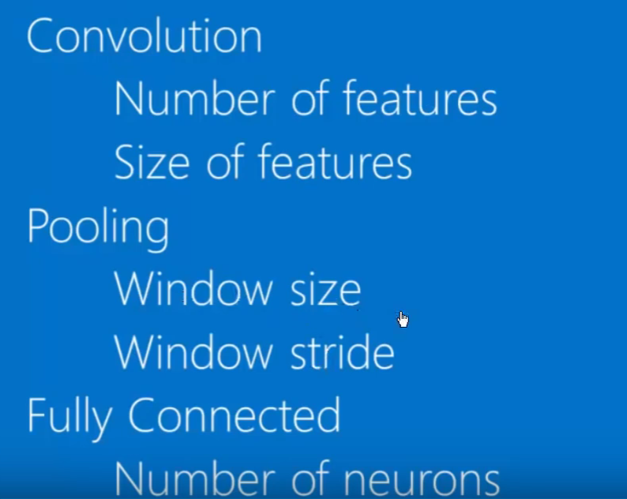
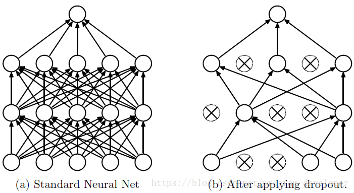
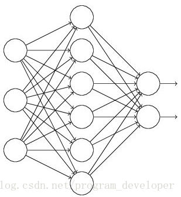
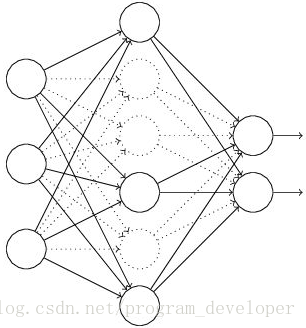

## 卷积神经网络

**1、卷积神经网络通常包含以下几种层：**  
+ **卷积层**（Convolutional layer）：卷积神经网路中每层卷积层由若干卷积单元组成，每个卷积单元的参数都是通过反向传播算法优化得到的。卷积运算的目的是提取输入的不同特征，第一层卷积层可能只能提取一些低级的特征如边缘、线条和角等层级，更多层的网络能从低级特征中迭代提取更复杂的特征。
+ **线性整流层**（Rectified Linear Units layer, ReLU layer）：这一层神经的活性化函数（Activation function）使用线性整流（Rectified Linear Units, ReLU）。
+ **池化层**（Pooling layer）：也叫下采样，通常在卷积层之后会得到维度很大的特征，将特征切成几个区域，取其最大值或平均值，得到新的、维度较小的特征。
+ **全连接层**（Fully-Connected layer）：把所有局部特征结合变成全局特征，用来计算最后每一类的得分。

**2、卷积层（Convolutional layer）**  
- **Features**，卷积层中用来跟图像进行卷积操作的小块，可以看作一个小图。所谓卷积操作就是将图像与 Features 的位置一一对应相乘，再将其相加求平均，这个值作为当前图像与 Features 的卷积值，随着 Features 跟着图像滑动，这些卷积值也形成了一个二维数组，这个二维数组就是卷积操作的结果，也可以理解为对原始图像过滤的结果，我们称之为 feature map，它是每一个 feature 从原始图像中提取出来的“特征”。其中的值，越接近为1表示对应位置和 feature 的匹配越完整，越是接近-1，表示对应位置和 feature 的反面匹配越完整，而值接近0的表示对应位置没有任何匹配或者说没有什么关联。原始图经过不同 feature 的卷积操作就变成了一系列的feature map。这就是卷积层的操作，也是卷积神经网络的由来。
- **神经元**，在一个 Feature 和整个图像的卷积过程中需要进行的卷积次数，Feature 每滑动一次进行一次卷积操作。
- **连接数**，在单次卷积操作中，feature 和图像对应相乘的次数，再加上阈值（或偏移量）的个数（一般为1），如5\*5的 feature，单次卷积中需要进行5*5=25次相乘，再加上阈值为1，总共26，所以连接数为26。

**3、线性整流层（ReLU layer）**  
ReLu层是利用一个激活函数（或叫做修正线性单元）进行修正的，其数学公式为：`f(x)=max(0,x)`，也就是说，对于输入的负值，输出全为0，对于正值，原样输出。

**4、池化层（Pooling Layer）**  
池化就是将输入图像进行缩小，减少像素信息，只保留重要信息。通常情况下，池化都是2\*2大小，比如对于 max-pooling 来说，就是取输入图像中2\*2大小的块中的最大值，作为结果的像素值，相当于将原始图像缩小了4倍 (注：同理，对于 average-pooling 来说，就是取2\*2大小块的平均值作为结果的像素值)。因为最大池化（max-pooling）保留了每一个小块内的最大值，所以它相当于保留了这一块最佳的匹配结果，即它能发现是否匹配，也不会在意是哪一个部分匹配。

**5、全连接层（Fully-Connected Layer）**  
将卷积结果排成一列向量`x{i}`，分别与输出两个神经元（X、O）全连接，这样一来就有12\*2=24个连接，每个连接都有一个权重`w{i}`,根据`y=sum(w_{i}*x_{i})`分别求出两个神经元的输出，一般而言输出结果通过一个逻辑函数，将结果缩放到0—1之间，然后对两个结果进行判定，取较大的值（如取X）。  
个人理解最后两个输出神经元对应的是可以进行判定的标准，比如我们进行完卷积神经网络识别后，要将其判断为猫或者狗，猫和狗都是我们进行判定的标准，感觉这个应该是事先训练好的。

**6、卷积神经网络结构**  
一般可以有多种嵌套方式，如以下：  
```
原图 -> 卷积层 -> ReLu层 -> 卷积层 -> ReLu层 -> 池化层 -> 卷积层 -> ReLu层 -> 池化层 -> 全连接层 -> 全连接层 -> 判定  
```
这一整个过程，从前往后，被称作“前向传播”，得到一组输出，然后通过反向传播来不断纠正错误，进行学习。

**7、反向传播算法BP**  
所谓反向传播，就是对比预测值和真实值，计算得到损失函数（误差），然后通过梯度下降（其实也就是求导），继而返回去修改网络参数（卷积核的权重这些参数）的过程，当损失函数最小的时候，就认为模型训练成功了。

**8、数据预处理**  
- 去均值  
各维度都减对应维度的均值，使得输入数据各个维度都中心化为0，进行去均值的原因是因为如果不去均值的话会容易拟合。这是因为如果在神经网络中，特征值`x`比较大的时候，会导致`W*x+b`的结果也会很大，这样进行激活函数（如relu）输出时，会导致对应位置数值变化量太小，进行反向传播时因为要使用这里的梯度进行计算，所以会导致梯度消散问题，导致参数改变量很小，也就会易于拟合，效果不好。

- 归一化  
进行归一化的原因是把各个特征的尺度控制在相同的范围内，这样可以便于找到最优解，能提高收敛效率，省事多了。  
（1）最值归一化，比如把最大值归一化成1，最小值归一化成-1；或把最大值归一化成1，最小值归一化成0。适用于本来就分布在有限范围内的数据。  
（2）均值方差归一化，一般是把均值归一化成0，方差归一化成1。适用于分布没有明显边界的情况。   


**9、名词解释**  
（1）鲁棒性：robust的音译，即健壮性，指系统在错误操作下，能够保持正确运行的能力。  
（2）超参数：即 Hyperparameters，在训练神经网络时初始的参数，例如在训练神经网络时一开始需要给定卷积核的尺寸、卷积核的数目，池化层的大小，池化层的步长，全连接层的神经元等这些参数。
<div align="center"></div>

**10、Dropout**  
Dropout可以作为训练深度神经网络的一种trick供选择。在每个训练批次中，通过忽略一半的特征检测器（让一半的隐层节点值为0），可以明显地减少过拟合现象。这种方式可以减少特征检测器（隐层节点）间的相互作用，检测器相互作用是指某些检测器依赖其他检测器才能发挥作用。  
Dropout说的简单一点就是：我们在前向传播的时候，让某个神经元的激活值以一定的概率p停止工作，这样可以使模型泛化性更强，因为它不会太依赖某些局部的特征，如图1所示。
<div align="center"></div>

- **Dropout具体工作流程**
<div align="center"></div>
正常的流程是：我们首先把x通过网络前向传播，然后把误差反向传播以决定如何更新参数让网络进行学习。  
使用Dropout之后，过程变成如下：
<div align="center"></div>

（1）首先随机（临时）删掉网络中一半的隐藏神经元，输入输出神经元保持不变  
（2） 然后把输入x通过修改后的网络前向传播，然后把得到的损失结果通过修改的网络反向传播。一小批训练样本执行完这个过程后，在没有被删除的神经元上按照随机梯度下降法更新对应的参数（w，b）  
（3）然后继续重复这一过程：  
. 恢复被删掉的神经元（此时被删除的神经元保持原样，而没有被删除的神经元已经有所更新）  
. 从隐藏层神经元中随机选择一个一半大小的子集临时删除掉（备份被删除神经元的参数）  
. 对一小批训练样本，先前向传播然后反向传播损失并根据随机梯度下降法更新参数（w，b） （没有被删除的那一部分参数得到更新，删除的神经元参数保持被删除前的结果）  

