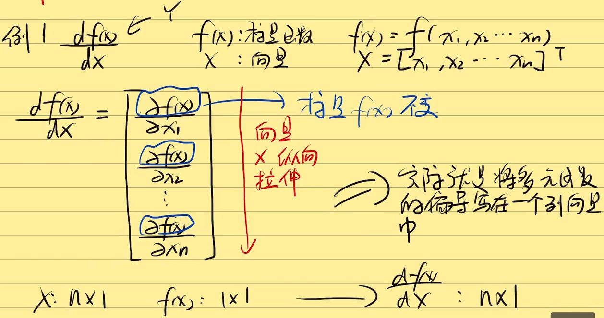
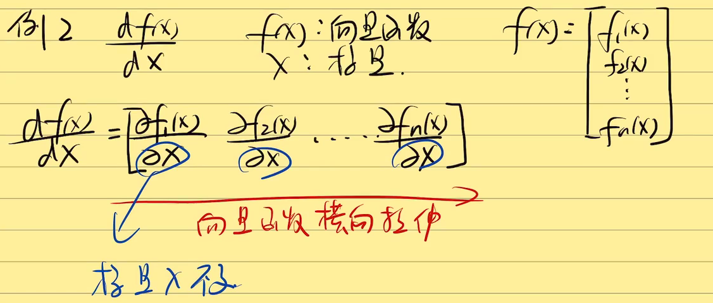
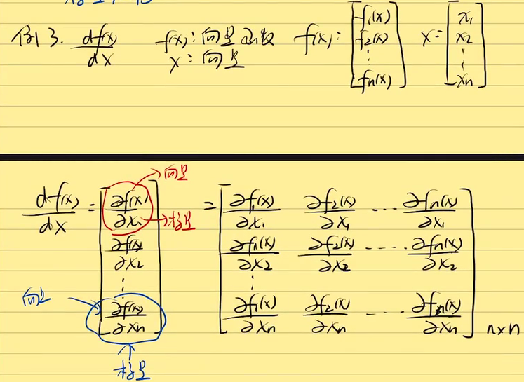
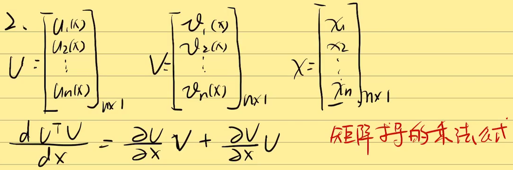
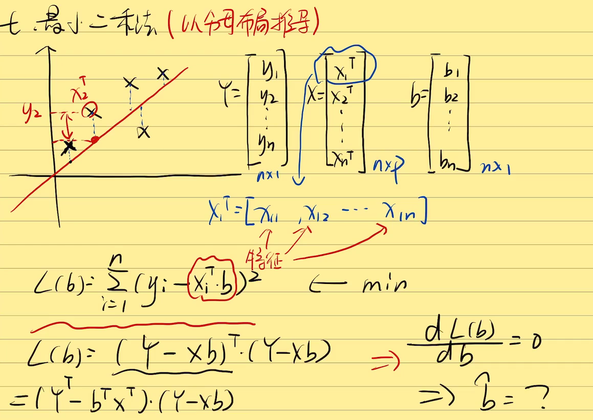
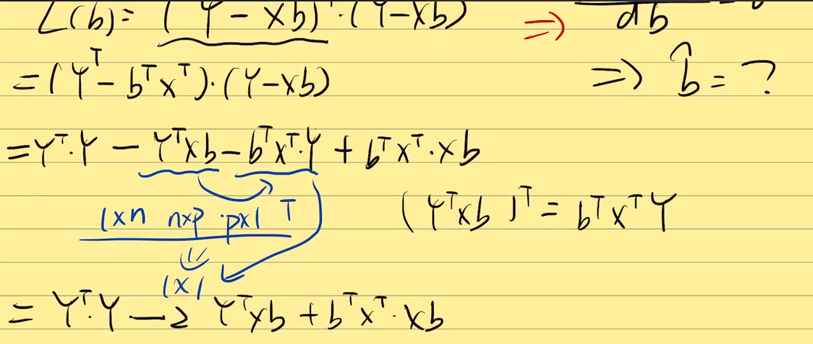
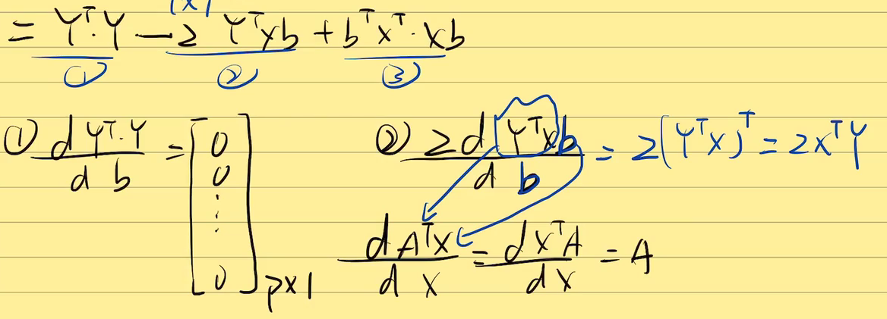
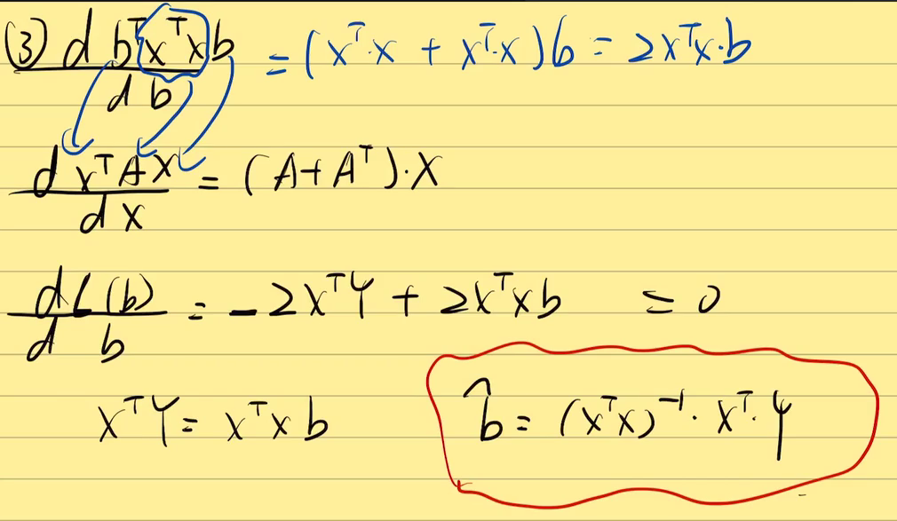

### 机器学习和深度学习中为什么需要矩阵求导?

- 在机器学习或者深度学习中有大量的数据，用向量的方法来表示即向量化是比较方便的，同时，向量化能加速计算机的运算。
- 求导在优化算法中有广泛的应用

### 矩阵求导的本质

- $dA/dB$ ：矩阵A中的每一个元素对矩阵B中的每一个元素求偏导      

- 从求导后元素个数角度

| A | B | $dA/dB$ |
| --- | --- | --- |
| 1×1 | 1×1 | 1×1 |
| 1×p | 1×n | p×n |
| p×q | m×n | p×q×m×n |

### 矩阵求导——YX拉伸术(重点)

$dY/dX$ 规则（分母布局） 
1. 标量不变，向量拉伸
2. 前面（Y）横向拉，后面（X）纵向拉

  

  

 

### 常见矩阵求导公式举例

- ${\frac{dA^TX}{dX}}={\frac{dX^TA}{dX}}=A$
- ${\frac{dX^TAX}{dX}=(A+A^T)X}$

### 矩阵求导细节补充

1. 两种布局
- 分母布局
    - 例子：YX拉伸术（Y横向、X纵向）
- 分子布局
    - 例子：XY拉伸术（X横向、Y纵向）
- 通常，分母布局的转置等于分子布局

2. 矩阵求导的乘法公式

 

3. 矩阵求导的加法公式

 

更多可参考 [The Matrix Cookbook](http://www2.imm.dtu.dk/pubdb/pubs/3274-full.html)中章节 `Derivatives of Matrices,Vectors and Scalar Forms`

### 最小二乘法举例

 

[参考视频和图文出处](https://www.bilibili.com/video/BV1xk4y1B7RQ?p=7&spm_id_from=pageDriver)