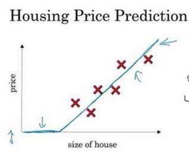

## 深度学习引言

- **深度学习**指的是**训练神经网络**。  
- **`ReLU`函数**，全称是**修正线性单元（`rectified linear unit`）**，它是一个**初始一段时间内为0，之后是一条直线的函数**，如图。
   

  

- **修正**指的是**在初始一段时间内取不小于零的值**。  
- **`supervised learnning`** ，即**监督学习**。  
- **`nature language processing`**，**自然语言文字处理`NLP`**。  
- 在图像处理中，经常使用**卷积神经网络`CNN`**。  
- 对于序列数据，如音频，由于包含了时间组件，所以语音信号作为一维时间序列，经常使用**递归神经网络`RNN`（`Recurrent Neural Network`）**，语言最自然的表示方式也是序列数据。  
- **结构化数据**，数据的基本数据库，每个特征都有一个很好的定义，例如在房价预测中，你可能有一个数据库，有专门的几列数据告诉你卧室的大小和数量，这就是结构化数据。  
- **非结构化数据**，比如音频，原始音频或者你想要识别的图像或文本中的内容，这里的特征可能是图像中的像素值或文本中的单个单词。  
- **要使神经网络获得较高的性能体现**，那么有两个条件：一是**训练一个规模足够大的神经网络**，以发挥数据规模量巨大的优点，二是需要**大量的数据**。  
- **`forward propagation`** : **前向传播**  
- **`backward propagation`** ：**反向传播**