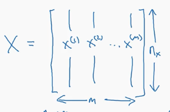
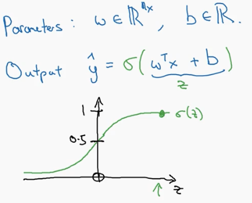
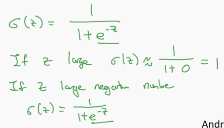
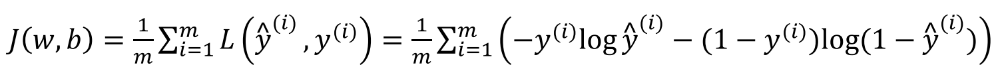

### 符号定义

**𝑥**：表示一个**𝑛𝑥维数据**，为输入数据，维度为(𝑛𝑥, 1)；  
**𝑦**：表示输出结果，在二分类情况下取值为(0,1)；  
**(𝑥(𝑖), 𝑦(𝑖))**：表示第𝑖组数据，可能是训练数据，也可能是测试数据，此处默认为训练数据；  
**𝑋 = [𝑥(1), 𝑥(2), . . . , 𝑥(𝑚)]** ：表示所有的训练数据集的输入值，放在一个 𝑛𝑥 × 𝑚的矩阵中，其中𝑚表示样本数目;   
**𝑌 = [𝑦(1), 𝑦(2), . . . , 𝑦(𝑚)]** ：对应表示所有训练数据集的输出值，维度为1 × 𝑚。  

  

### 二分分类

**二分分类** 就是**输入特征向量后，预测输出结果为0还是1**。例如，在猫分类问题上，我们以图片的特征向量作为输入，然后预测输出结果𝑦，0表示没有猫，而1表示有猫。  

### 逻辑回归(Logistic Regression)

- **逻辑回归学习算法**，该算法**适用于二分类问题**。  
- 对于二元分类问题，**给定一个输入特征向量X，输出预测结果 $\hat{y}$，$\hat{y}$ 也就是对实际值y的估计**。换句话来说，如果𝑋是我们在上个视频看到的图片，你想让 $\hat{y}$ 来告诉你这是一只猫的图片的机率有多大。  
- 𝑋是一个𝑛𝑥维的向量（相当于有𝑛𝑥个特征的特征向量），我们用**𝑤来表示逻辑回归的参数**，这也是一个**𝑛𝑥维向量**（因为**𝑤实际上是特征权重，维度与特征向量相同**），参数里面还有**𝑏，这是一个实数（表示偏差）**。  
- 在做**线性回归**时可以做**关于输入的线性函数 $\hat{y}=𝑤𝑇𝑥+𝑏$**,但是这对于二元分类问题来说不是一个非常好的算法，因为想让 $\hat{y}$ 表示实际值𝑦等于1的机率的话，$\hat{y}$ 应该在0到1之间，而 𝑤𝑇𝑥 + 𝑏 可能比1要大得多，或者甚至为一个负值。因此在逻辑回归中，我们的输出应该是 **$\hat{y}$ 等于**由上面得到的**线性函数式子作为自变量的sigmoid 函数**中，公式如下右图所示，**将线性函数转换为非线性函数**。  

  

因此当我们**实现逻辑回归时**，我们的工作就是去**让机器学习参数𝑤以及𝑏**这样才使得 $\hat{y}$ 成为对 𝑦=1 这一情况的概率的一个很好的估计。  

### Logistic回归损失函数

$~~~~~~~~$ **损失函数**又叫做**误差函数**，用来**衡量算法的运行情况，衡量预测输出值和实际值有多接近**,  
**Loss function:$𝐿(\hat{y} , 𝑦)$**。   
$~~~~~~~~$ **一般情况下损失函数**我们用**预测值和实际值的平方差**或者它们**平方差的一半**来定义，但是通常在逻辑回归中我们不这么做，因为当我们在学习逻辑回归参数w和b的时候，会发现我们的**优化目标不是凸优化**，只能找到**多个局部最优值**，**梯度下降法很可能找不到全局最优值**。  
$~~~~~~~~$ **在逻辑回归中用的损失函数是:** $𝐿(\hat{y} , 𝑦) = −𝑦log(\hat{y}) − (1 − 𝑦)log(1 − \hat{y})$   
$~~~~~~~~$ **为什么要用这个函数作为逻辑损失函数？** 当我们使用平方误差作为损失函数的时候，你会想要让这个误差尽可能地小，**对于这个逻辑回归损失函数，我们也想让它尽可能地小**。上述的损失函数当 𝑦 = 1 时损失函数 $𝐿 = −log(\hat{y})$ ，如果想要损失函数 𝐿 尽可能得小，那么 $\hat{y}$ 就要尽可能大，因为 sigmoid 函数取值[0,1]，所以 $\hat{y}$ 会无限接近于 1。 当 𝑦 = 0 时损失函数 $𝐿 = −log(1 − \hat{y})$ ，如果想要损失函数 𝐿 尽可能得小，那么 $\hat{y}$ 就要尽可能小，因为 sigmoid 函数取值[0,1]，所以$\hat{y}$会无限接近于 0。  
$~~~~~~~~$ 有很多的函数效果和上述函数类似，就是**如果𝑦等于 1，我们就尽可能让 $\hat{y}$ 变大，如果𝑦等于 0，我们就尽可能让 $\hat{y}$ 变小**。  
$~~~~~~~~$ **损失函数是在单个训练样本中定义的，它衡量的是算法在单个训练样本中表现如何**，为了**衡量算法在全部训练样本上的表现如何**，我们需要定义一个**算法的代价函数**，算法的代价函数是**对𝑚个样本的损失函数求和然后除以𝑚**: 

  

$~~~~~~~~$ 损失函数只适用于像这样的单个训练样本，而代价函数是参数的总代价，所以**在训练逻辑回归模型时候，我们需要找到合适的𝑤和𝑏，来让代价函数 𝐽 的总代价降到最低。**